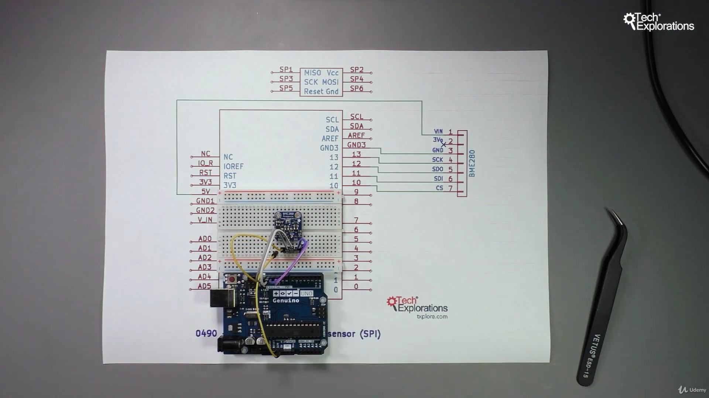
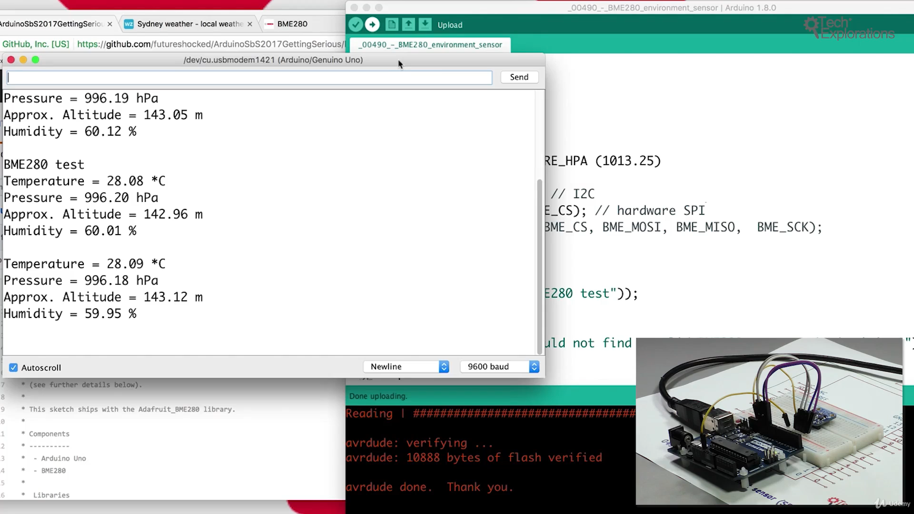
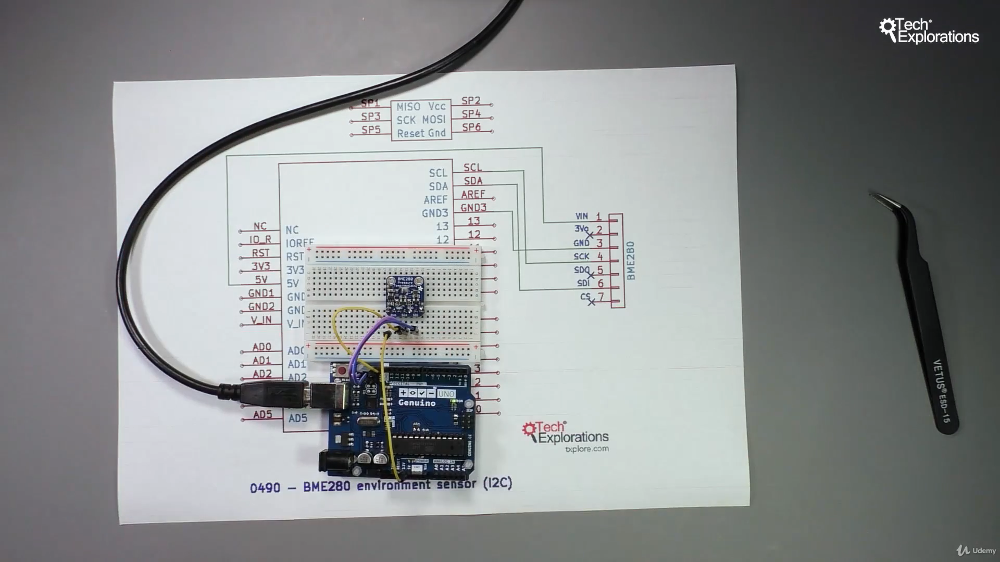
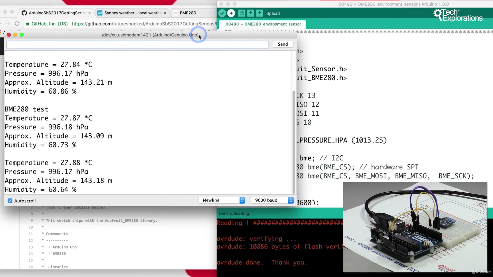
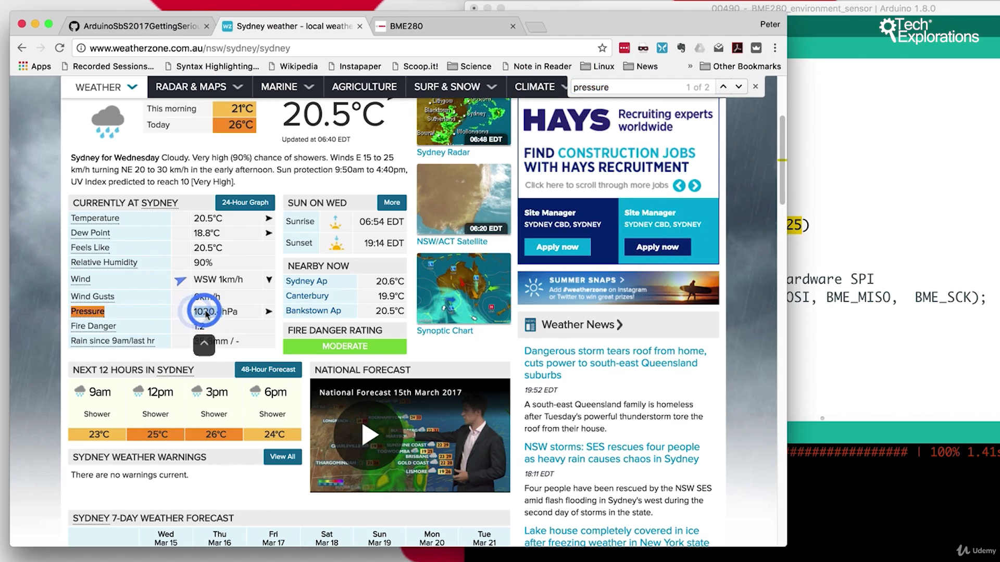
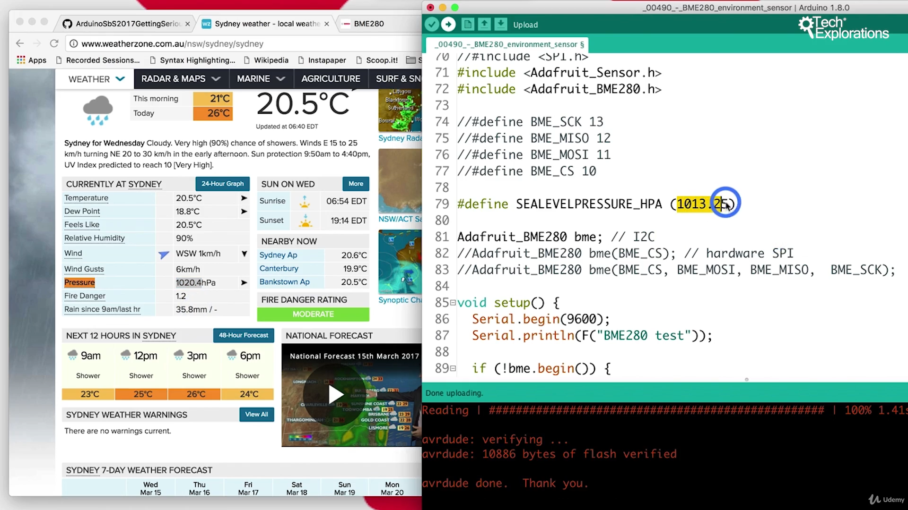
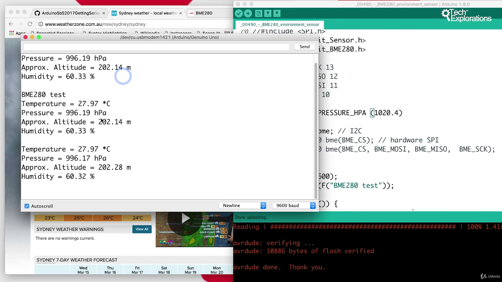

8. [0490a] [Introduction to the BME280](#8)
9. [0490b] [BME280 SPI wiring](#9)
10. [0490c] [BME280 I2C wiring](#10)
11. [0490d] [BME280 Sketch walkthrough and demo](#11)

---

### 8. [0490a] Introduction to the BME280<a id="8"></a>

- BME280 bosh sensor specification [click me](https://www.bosch-sensortec.com/products/environmental-sensors/humidity-sensors-bme280/)
- BME280 bosh sensor datasheet [click me](https://www.mouser.com/datasheet/2/783/BST-BME280-DS002-1509607.pdf)

### 9. [0490b] BME280 SPI wiring<a id="9"></a>




#### Output



- Open arduino Ide, go to Sketch--> include library--> manges libraries--> search: bme280 by adafruit--> install
- Open arduino Ide, go to File--> example--> adafruit BME280 library--> BME280 test
- select board, select port
- edit code

```ino
/*  0490 - BME280 Environment sensor
 *
 * This sketch shows you how to use the BME280 sensor, connected via
 * the SPI or I2C interface
 *
 * This sketch was written by Limor Fried & Kevin Townsend for Adafruit Industries
 * (see further details below).
 *
 * This sketch ships with the Adafruit_BME280 library.
 *
 * Components
 * ----------
 *  - Arduino Uno
 *  - BME280
 *
 *  Libraries
 *  ---------
 *  - Adafruit_Sensor
 *  - Adafruit_BME280
 *
 * Connections
 * -----------
 *  To use the I2C interface:
 *
 *  Arduino Uno   |     BME280
 *  ------------------------------
 *        5V      |       Vin
 *        GND     |       GND
 *     SCL or A5  |       SCK
 *     SDA or A4  |       SDI
 *
 * To use the SPI interface:
 *
 *  Arduino Uno   |     BME280
 *  ------------------------------
 *        5V      |       Vin
 *        GND     |       GND
 *        13      |       SCK
 *        12      |       SDO
 *        11      |       SDI
 *        10      |       CS
 *
 *
 *  It is possible to use any other digital pins in
 *  order to implement the SPI interface.
 *
 *  Created on March 14 2017 by Peter Dalmaris
 *
 */


/***************************************************************************
  This is a library for the BME280 humidity, temperature & pressure sensor

  Designed specifically to work with the Adafruit BME280 Breakout
  ----> http://www.adafruit.com/products/2650

  These sensors use I2C or SPI to communicate, 2 or 4 pins are required
  to interface.

  Adafruit invests time and resources providing this open source code,
  please support Adafruit andopen-source hardware by purchasing products
  from Adafruit!

  Written by Limor Fried & Kevin Townsend for Adafruit Industries.
  BSD license, all text above must be included in any redistribution
 ***************************************************************************/

#include <Wire.h>
#include <SPI.h> // 1️⃣
#include <Adafruit_Sensor.h>
#include <Adafruit_BME280.h>

// 2️⃣ uncomment SPI pins
#define BME_SCK 13
#define BME_MISO 12
#define BME_MOSI 11
#define BME_CS 10

#define SEALEVELPRESSURE_HPA (1020.4)

// Adafruit_BME280 bme; // I2C
Adafruit_BME280 bme(BME_CS); // 3️⃣ hardware SPI
//Adafruit_BME280 bme(BME_CS, BME_MOSI, BME_MISO,  BME_SCK);

void setup() {
  Serial.begin(9600);
  Serial.println(F("BME280 test"));

  if (!bme.begin()) {
    Serial.println("Could not find a valid BME280 sensor, check wiring!");
    while (1);
  }
}

void loop() {
    Serial.print("Temperature = ");
    Serial.print(bme.readTemperature());
    Serial.println(" *C");

    Serial.print("Pressure = ");

    Serial.print(bme.readPressure() / 100.0F);
    Serial.println(" hPa");

    Serial.print("Approx. Altitude = ");
    Serial.print(bme.readAltitude(SEALEVELPRESSURE_HPA));
    Serial.println(" m");

    Serial.print("Humidity = ");
    Serial.print(bme.readHumidity());
    Serial.println(" %");

    Serial.println();
    delay(2000);
}
```

### 10. [0490c] BME280 I2C wiring<a id="10"></a>




#### Output



- Open arduino Ide, go to Sketch--> include library--> manges libraries--> search: bme280 by adafruit--> install
- Open arduino Ide, go to File--> example--> adafruit BME280 library--> BME280 test
- select board, select port
- edit code

```ino
/*  0490 - BME280 Environment sensor
 *
 * This sketch shows you how to use the BME280 sensor, connected via
 * the SPI or I2C interface
 *
 * This sketch was written by Limor Fried & Kevin Townsend for Adafruit Industries
 * (see further details below).
 *
 * This sketch ships with the Adafruit_BME280 library.
 *
 * Components
 * ----------
 *  - Arduino Uno
 *  - BME280
 *
 *  Libraries
 *  ---------
 *  - Adafruit_Sensor
 *  - Adafruit_BME280
 *
 * Connections
 * -----------
 *  To use the I2C interface:
 *
 *  Arduino Uno   |     BME280
 *  ------------------------------
 *        5V      |       Vin
 *        GND     |       GND
 *     SCL or A5  |       SCK
 *     SDA or A4  |       SDI
 *
 * To use the SPI interface:
 *
 *  Arduino Uno   |     BME280
 *  ------------------------------
 *        5V      |       Vin
 *        GND     |       GND
 *        13      |       SCK
 *        12      |       SDO
 *        11      |       SDI
 *        10      |       CS
 *
 *
 *  It is possible to use any other digital pins in
 *  order to implement the SPI interface.
 *
 *  Created on March 14 2017 by Peter Dalmaris
 *
 */


/***************************************************************************
  This is a library for the BME280 humidity, temperature & pressure sensor

  Designed specifically to work with the Adafruit BME280 Breakout
  ----> http://www.adafruit.com/products/2650

  These sensors use I2C or SPI to communicate, 2 or 4 pins are required
  to interface.

  Adafruit invests time and resources providing this open source code,
  please support Adafruit andopen-source hardware by purchasing products
  from Adafruit!

  Written by Limor Fried & Kevin Townsend for Adafruit Industries.
  BSD license, all text above must be included in any redistribution
 ***************************************************************************/

#include <Wire.h>
//#include <SPI.h>    // 1️⃣ comment this line
#include <Adafruit_Sensor.h>
#include <Adafruit_BME280.h>

// 2️⃣ comment SPI lines
//#define BME_SCK 13
//#define BME_MISO 12
//#define BME_MOSI 11
//#define BME_CS 10

#define SEALEVELPRESSURE_HPA (1020.4)

Adafruit_BME280 bme; // I2C
//Adafruit_BME280 bme(BME_CS); // 3️⃣comment hardware SPI
//Adafruit_BME280 bme(BME_CS, BME_MOSI, BME_MISO,  BME_SCK);

void setup() {
  Serial.begin(9600);
  Serial.println(F("BME280 test"));

  if (!bme.begin()) {
    Serial.println("Could not find a valid BME280 sensor, check wiring!");
    while (1);
  }
}

void loop() {
    Serial.print("Temperature = ");
    Serial.print(bme.readTemperature());
    Serial.println(" *C");

    Serial.print("Pressure = ");

    Serial.print(bme.readPressure() / 100.0F);
    Serial.println(" hPa");

    Serial.print("Approx. Altitude = ");
    Serial.print(bme.readAltitude(SEALEVELPRESSURE_HPA));
    Serial.println(" m");

    Serial.print("Humidity = ");
    Serial.print(bme.readHumidity());
    Serial.println(" %");

    Serial.println();
    delay(2000);
}
```

### 11. [0490d] BME280 Sketch walkthrough and demo<a id="11"></a>

#### How to calibrate pressure value from weather news site





#### Output



```ino
/*  0490 - BME280 Environment sensor
 *
 * This sketch shows you how to use the BME280 sensor, connected via
 * the SPI or I2C interface
 *
 * This sketch was written by Limor Fried & Kevin Townsend for Adafruit Industries
 * (see further details below).
 *
 * This sketch ships with the Adafruit_BME280 library.
 *
 * Components
 * ----------
 *  - Arduino Uno
 *  - BME280
 *
 *  Libraries
 *  ---------
 *  - Adafruit_Sensor
 *  - Adafruit_BME280
 *
 * Connections
 * -----------
 *  To use the I2C interface:
 *
 *  Arduino Uno   |     BME280
 *  ------------------------------
 *        5V      |       Vin
 *        GND     |       GND
 *     SCL or A5  |       SCK
 *     SDA or A4  |       SDI
 *
 * To use the SPI interface:
 *
 *  Arduino Uno   |     BME280
 *  ------------------------------
 *        5V      |       Vin
 *        GND     |       GND
 *        13      |       SCK
 *        12      |       SDO
 *        11      |       SDI
 *        10      |       CS
 *
 *
 *  It is possible to use any other digital pins in
 *  order to implement the SPI interface.
 *
 *  Created on March 14 2017 by Peter Dalmaris
 *
 */


/***************************************************************************
  This is a library for the BME280 humidity, temperature & pressure sensor

  Designed specifically to work with the Adafruit BME280 Breakout
  ----> http://www.adafruit.com/products/2650

  These sensors use I2C or SPI to communicate, 2 or 4 pins are required
  to interface.

  Adafruit invests time and resources providing this open source code,
  please support Adafruit andopen-source hardware by purchasing products
  from Adafruit!

  Written by Limor Fried & Kevin Townsend for Adafruit Industries.
  BSD license, all text above must be included in any redistribution
 ***************************************************************************/

#include <Wire.h>
//#include <SPI.h>
#include <Adafruit_Sensor.h>
#include <Adafruit_BME280.h>  //  class to create object

//#define BME_SCK 13
//#define BME_MISO 12
//#define BME_MOSI 11
//#define BME_CS 10

#define SEALEVELPRESSURE_HPA (1020.4)

// Create bme-object using Adafruit_BME280.h, header file
Adafruit_BME280 bme; // I2C
//Adafruit_BME280 bme(BME_CS); // hardware SPI
//Adafruit_BME280 bme(BME_CS, BME_MOSI, BME_MISO,  BME_SCK);

void setup() {
  Serial.begin(9600);
  Serial.println(F("BME280 test"));

// check communication establish with Arduino and sensor
  if (!bme.begin()) {
    Serial.println("Could not find a valid BME280 sensor, check wiring!");
    while (1);
  }
}

void loop() {
    Serial.print("Temperature = ");

    // use bme.readTemperature() method to get value
    Serial.print(bme.readTemperature());
    Serial.println(" *C");

    Serial.print("Pressure = ");

    Serial.print(bme.readPressure() / 100.0F);
    Serial.println(" hPa");

    Serial.print("Approx. Altitude = ");
    Serial.print(bme.readAltitude(SEALEVELPRESSURE_HPA));
    Serial.println(" m");

    Serial.print("Humidity = ");
    Serial.print(bme.readHumidity());
    Serial.println(" %");

    Serial.println();
    delay(2000);
}
```

Notice-

- Adafruit_BME280.h has class to create BME object, Object has method for reading sensor value
- SPI: uses MOSI, MISO, SCK, CS pins and uses SPI.h file to establish communication
- TWI: uses SCK, SDI pins and uses Wire.h file to establish communication
