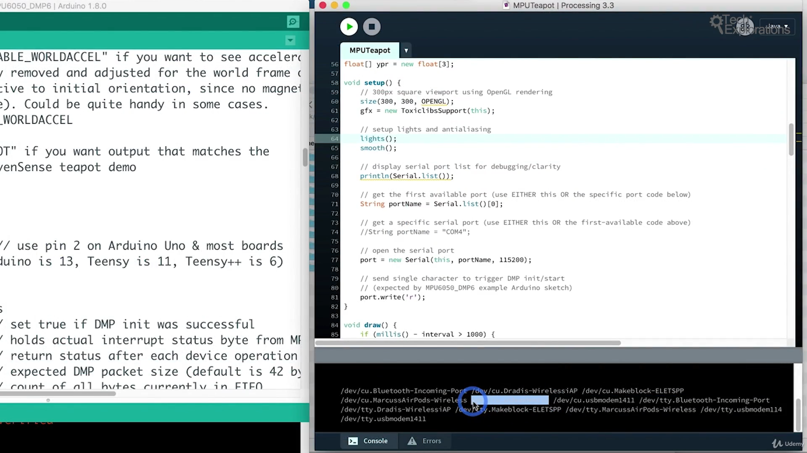

12. [0540a] [Introduction to the MPU6050 motion sensor](#12)
13. [0540b] [A look at the MPU6050 datasheet](#13)
14. [0540c] [MPU6050 wiring](#14)
15. [0540d] [MPU6050 Arduino sketch](#15)
16. [0540e] [MPU6050 Processing demonstration](#16)
17. [0540f] [MPU6050 bonus lecture](#17)

---

### 12. [0540a] Introduction to the MPU6050 motion sensor<a id="12"></a>

### 13. [0540b] A look at the MPU6050 datasheet<a id="13"></a>

- MPU6050 motion sensor datasheet [click me](https://invensense.tdk.com/wp-content/uploads/2015/02/MPU-6000-Datasheet1.pdf)

#### Feature

- 6-Axis motion sensor: rotation(gyro), acceleration(accelerometer)
- DMP(digital motion processing): to filter noise and give smooth signal, by another chip
- 16 bit builtin ADC

### 14. [0540c] MPU6050 wiring<a id="14"></a>

#### Schematic


#### Address


- Interrupt: The interrupt is initiated by mpu6050 to arduino, then arduino stop from what is doing and listen to mpu6050
- Here on hardware we have used pins A4(SDA), A5(SCL) as they are close for jumper wire

### 15. [0540d] MPU6050 Arduino sketch<a id="15"></a>

- github, download repo from github to local system and extract it [click me](https://github.com/jrowberg/i2cdevlib.git)
- Copy 2 folder from arduino folder: mpu6050, I2Cdev

#### How to know sketchbook location, where libraries are installed

- Open arduino IDE, go to file--> preference--> sketchbook location

```sh
My location
C:\Users\91958\Documents\Arduino\libraries
```

- Now copy mpu6050, I2Cdev folder inside libraries-folder
- restart arduino ide
- open arduino IDE go to file--> example--> mpu6050--> mpu6050_raw

#### How to change serial monitor baud rate


#### Sketch 1 without mpu with noise

```ino
// I2C device class (I2Cdev) demonstration Arduino sketch for MPU6050 class
// 10/7/2011 by Jeff Rowberg <jeff@rowberg.net>
// Updates should (hopefully) always be available at https://github.com/jrowberg/i2cdevlib
//
// Changelog:
//      2013-05-08 - added multiple output formats
//                 - added seamless Fastwire support
//      2011-10-07 - initial release

/* ============================================
I2Cdev device library code is placed under the MIT license
Copyright (c) 2011 Jeff Rowberg

Permission is hereby granted, free of charge, to any person obtaining a copy
of this software and associated documentation files (the "Software"), to deal
in the Software without restriction, including without limitation the rights
to use, copy, modify, merge, publish, distribute, sublicense, and/or sell
copies of the Software, and to permit persons to whom the Software is
furnished to do so, subject to the following conditions:

The above copyright notice and this permission notice shall be included in
all copies or substantial portions of the Software.

THE SOFTWARE IS PROVIDED "AS IS", WITHOUT WARRANTY OF ANY KIND, EXPRESS OR
IMPLIED, INCLUDING BUT NOT LIMITED TO THE WARRANTIES OF MERCHANTABILITY,
FITNESS FOR A PARTICULAR PURPOSE AND NONINFRINGEMENT. IN NO EVENT SHALL THE
AUTHORS OR COPYRIGHT HOLDERS BE LIABLE FOR ANY CLAIM, DAMAGES OR OTHER
LIABILITY, WHETHER IN AN ACTION OF CONTRACT, TORT OR OTHERWISE, ARISING FROM,
OUT OF OR IN CONNECTION WITH THE SOFTWARE OR THE USE OR OTHER DEALINGS IN
THE SOFTWARE.
===============================================
*/

// I2Cdev and MPU6050 must be installed as libraries, or else the .cpp/.h files
// for both classes must be in the include path of your project
#include "I2Cdev.h"
#include "MPU6050.h"

// Arduino Wire library is required if I2Cdev I2CDEV_ARDUINO_WIRE implementation
// is used in I2Cdev.h
#if I2CDEV_IMPLEMENTATION == I2CDEV_ARDUINO_WIRE
    #include "Wire.h"
#endif

// class default I2C address is 0x68
// specific I2C addresses may be passed as a parameter here
// AD0 low = 0x68 (default for InvenSense evaluation board)
// AD0 high = 0x69
MPU6050 accelgyro;
//MPU6050 accelgyro(0x69); // <-- use for AD0 high
//MPU6050 accelgyro(0x68, &Wire1); // <-- use for AD0 low, but 2nd Wire (TWI/I2C) object

int16_t ax, ay, az;
int16_t gx, gy, gz;


// uncomment "OUTPUT_READABLE_ACCELGYRO" if you want to see a tab-separated
// list of the accel X/Y/Z and then gyro X/Y/Z values in decimal. Easy to read,
// not so easy to parse, and slow(er) over UART.
#define OUTPUT_READABLE_ACCELGYRO

// uncomment "OUTPUT_BINARY_ACCELGYRO" to send all 6 axes of data as 16-bit
// binary, one right after the other. This is very fast (as fast as possible
// without compression or data loss), and easy to parse, but impossible to read
// for a human.
//#define OUTPUT_BINARY_ACCELGYRO


#define LED_PIN 13
bool blinkState = false;

void setup() {
    // join I2C bus (I2Cdev library doesn't do this automatically)
    #if I2CDEV_IMPLEMENTATION == I2CDEV_ARDUINO_WIRE
        Wire.begin();
    #elif I2CDEV_IMPLEMENTATION == I2CDEV_BUILTIN_FASTWIRE
        Fastwire::setup(400, true);
    #endif

    // initialize serial communication
    // (38400 chosen because it works as well at 8MHz as it does at 16MHz, but
    // it's really up to you depending on your project)
    Serial.begin(38400);

    // initialize device
    Serial.println("Initializing I2C devices...");
    accelgyro.initialize();

    // verify connection
    Serial.println("Testing device connections...");
    Serial.println(accelgyro.testConnection() ? "MPU6050 connection successful" : "MPU6050 connection failed");

    // use the code below to change accel/gyro offset values
    /*
    Serial.println("Updating internal sensor offsets...");
    // -76	-2359	1688	0	0	0
    Serial.print(accelgyro.getXAccelOffset()); Serial.print("\t"); // -76
    Serial.print(accelgyro.getYAccelOffset()); Serial.print("\t"); // -2359
    Serial.print(accelgyro.getZAccelOffset()); Serial.print("\t"); // 1688
    Serial.print(accelgyro.getXGyroOffset()); Serial.print("\t"); // 0
    Serial.print(accelgyro.getYGyroOffset()); Serial.print("\t"); // 0
    Serial.print(accelgyro.getZGyroOffset()); Serial.print("\t"); // 0
    Serial.print("\n");
    accelgyro.setXGyroOffset(220);
    accelgyro.setYGyroOffset(76);
    accelgyro.setZGyroOffset(-85);
    Serial.print(accelgyro.getXAccelOffset()); Serial.print("\t"); // -76
    Serial.print(accelgyro.getYAccelOffset()); Serial.print("\t"); // -2359
    Serial.print(accelgyro.getZAccelOffset()); Serial.print("\t"); // 1688
    Serial.print(accelgyro.getXGyroOffset()); Serial.print("\t"); // 0
    Serial.print(accelgyro.getYGyroOffset()); Serial.print("\t"); // 0
    Serial.print(accelgyro.getZGyroOffset()); Serial.print("\t"); // 0
    Serial.print("\n");
    */

    // configure Arduino LED pin for output
    pinMode(LED_PIN, OUTPUT);
}

void loop() {
    // read raw accel/gyro measurements from device
    accelgyro.getMotion6(&ax, &ay, &az, &gx, &gy, &gz);

    // these methods (and a few others) are also available
    //accelgyro.getAcceleration(&ax, &ay, &az);
    //accelgyro.getRotation(&gx, &gy, &gz);

    #ifdef OUTPUT_READABLE_ACCELGYRO
        // display tab-separated accel/gyro x/y/z values
        Serial.print("a/g:\t");
        Serial.print(ax); Serial.print("\t");
        Serial.print(ay); Serial.print("\t");
        Serial.print(az); Serial.print("\t");
        Serial.print(gx); Serial.print("\t");
        Serial.print(gy); Serial.print("\t");
        Serial.println(gz);
    #endif

    #ifdef OUTPUT_BINARY_ACCELGYRO
        Serial.write((uint8_t)(ax >> 8)); Serial.write((uint8_t)(ax & 0xFF));
        Serial.write((uint8_t)(ay >> 8)); Serial.write((uint8_t)(ay & 0xFF));
        Serial.write((uint8_t)(az >> 8)); Serial.write((uint8_t)(az & 0xFF));
        Serial.write((uint8_t)(gx >> 8)); Serial.write((uint8_t)(gx & 0xFF));
        Serial.write((uint8_t)(gy >> 8)); Serial.write((uint8_t)(gy & 0xFF));
        Serial.write((uint8_t)(gz >> 8)); Serial.write((uint8_t)(gz & 0xFF));
    #endif

    // blink LED to indicate activity
    blinkState = !blinkState;
    digitalWrite(LED_PIN, blinkState);
    delay(100);
}
```

#### Output with noise


---

#### Sketch 2: With DMP smooth filtered signal

- open arduino IDE go to file--> example--> mpu6050--> mpu6050_DMP6

#### How to change baud rate


#### Output


#### Yaw pitch roll for quad copter


#### Sketch

```ino
// I2C device class (I2Cdev) demonstration Arduino sketch for MPU6050 class using DMP (MotionApps v2.0)
// 6/21/2012 by Jeff Rowberg <jeff@rowberg.net>
// Updates should (hopefully) always be available at https://github.com/jrowberg/i2cdevlib
//
// Changelog:
//      2019-07-08 - Added Auto Calibration and offset generator
//		   - and altered FIFO retrieval sequence to avoid using blocking code
//      2016-04-18 - Eliminated a potential infinite loop
//      2013-05-08 - added seamless Fastwire support
//                 - added note about gyro calibration
//      2012-06-21 - added note about Arduino 1.0.1 + Leonardo compatibility error
//      2012-06-20 - improved FIFO overflow handling and simplified read process
//      2012-06-19 - completely rearranged DMP initialization code and simplification
//      2012-06-13 - pull gyro and accel data from FIFO packet instead of reading directly
//      2012-06-09 - fix broken FIFO read sequence and change interrupt detection to RISING
//      2012-06-05 - add gravity-compensated initial reference frame acceleration output
//                 - add 3D math helper file to DMP6 example sketch
//                 - add Euler output and Yaw/Pitch/Roll output formats
//      2012-06-04 - remove accel offset clearing for better results (thanks Sungon Lee)
//      2012-06-01 - fixed gyro sensitivity to be 2000 deg/sec instead of 250
//      2012-05-30 - basic DMP initialization working

/* ============================================
I2Cdev device library code is placed under the MIT license
Copyright (c) 2012 Jeff Rowberg

Permission is hereby granted, free of charge, to any person obtaining a copy
of this software and associated documentation files (the "Software"), to deal
in the Software without restriction, including without limitation the rights
to use, copy, modify, merge, publish, distribute, sublicense, and/or sell
copies of the Software, and to permit persons to whom the Software is
furnished to do so, subject to the following conditions:

The above copyright notice and this permission notice shall be included in
all copies or substantial portions of the Software.

THE SOFTWARE IS PROVIDED "AS IS", WITHOUT WARRANTY OF ANY KIND, EXPRESS OR
IMPLIED, INCLUDING BUT NOT LIMITED TO THE WARRANTIES OF MERCHANTABILITY,
FITNESS FOR A PARTICULAR PURPOSE AND NONINFRINGEMENT. IN NO EVENT SHALL THE
AUTHORS OR COPYRIGHT HOLDERS BE LIABLE FOR ANY CLAIM, DAMAGES OR OTHER
LIABILITY, WHETHER IN AN ACTION OF CONTRACT, TORT OR OTHERWISE, ARISING FROM,
OUT OF OR IN CONNECTION WITH THE SOFTWARE OR THE USE OR OTHER DEALINGS IN
THE SOFTWARE.
===============================================
*/

// I2Cdev and MPU6050 must be installed as libraries, or else the .cpp/.h files
// for both classes must be in the include path of your project
#include "I2Cdev.h"

#include "MPU6050_6Axis_MotionApps20.h"
//#include "MPU6050.h" // not necessary if using MotionApps include file

// Arduino Wire library is required if I2Cdev I2CDEV_ARDUINO_WIRE implementation
// is used in I2Cdev.h
#if I2CDEV_IMPLEMENTATION == I2CDEV_ARDUINO_WIRE
    #include "Wire.h"
#endif

// class default I2C address is 0x68
// specific I2C addresses may be passed as a parameter here
// AD0 low = 0x68 (default for SparkFun breakout and InvenSense evaluation board)
// AD0 high = 0x69
MPU6050 mpu;
//MPU6050 mpu(0x69); // <-- use for AD0 high

/* =========================================================================
   NOTE: In addition to connection 3.3v, GND, SDA, and SCL, this sketch
   depends on the MPU-6050's INT pin being connected to the Arduino's
   external interrupt #0 pin. On the Arduino Uno and Mega 2560, this is
   digital I/O pin 2.
 * ========================================================================= */

/* =========================================================================
   NOTE: Arduino v1.0.1 with the Leonardo board generates a compile error
   when using Serial.write(buf, len). The Teapot output uses this method.
   The solution requires a modification to the Arduino USBAPI.h file, which
   is fortunately simple, but annoying. This will be fixed in the next IDE
   release. For more info, see these links:

   http://arduino.cc/forum/index.php/topic,109987.0.html
   http://code.google.com/p/arduino/issues/detail?id=958
 * ========================================================================= */


// uncomment "OUTPUT_READABLE_QUATERNION" if you want to see the actual
// quaternion components in a [w, x, y, z] format (not best for parsing
// on a remote host such as Processing or something though)
//#define OUTPUT_READABLE_QUATERNION

// uncomment "OUTPUT_READABLE_EULER" if you want to see Euler angles
// (in degrees) calculated from the quaternions coming from the FIFO.
// Note that Euler angles suffer from gimbal lock (for more info, see
// http://en.wikipedia.org/wiki/Gimbal_lock)
//#define OUTPUT_READABLE_EULER

// uncomment "OUTPUT_READABLE_YAWPITCHROLL" if you want to see the yaw/
// pitch/roll angles (in degrees) calculated from the quaternions coming
// from the FIFO. Note this also requires gravity vector calculations.
// Also note that yaw/pitch/roll angles suffer from gimbal lock (for
// more info, see: http://en.wikipedia.org/wiki/Gimbal_lock)
#define OUTPUT_READABLE_YAWPITCHROLL

// uncomment "OUTPUT_READABLE_REALACCEL" if you want to see acceleration
// components with gravity removed. This acceleration reference frame is
// not compensated for orientation, so +X is always +X according to the
// sensor, just without the effects of gravity. If you want acceleration
// compensated for orientation, us OUTPUT_READABLE_WORLDACCEL instead.
//#define OUTPUT_READABLE_REALACCEL

// uncomment "OUTPUT_READABLE_WORLDACCEL" if you want to see acceleration
// components with gravity removed and adjusted for the world frame of
// reference (yaw is relative to initial orientation, since no magnetometer
// is present in this case). Could be quite handy in some cases.
//#define OUTPUT_READABLE_WORLDACCEL

// uncomment "OUTPUT_TEAPOT" if you want output that matches the
// format used for the InvenSense teapot demo
//#define OUTPUT_TEAPOT


#define INTERRUPT_PIN 2  // use pin 2 on Arduino Uno & most boards
#define LED_PIN 13 // (Arduino is 13, Teensy is 11, Teensy++ is 6)
bool blinkState = false;

// MPU control/status vars
bool dmpReady = false;  // set true if DMP init was successful
uint8_t mpuIntStatus;   // holds actual interrupt status byte from MPU
uint8_t devStatus;      // return status after each device operation (0 = success, !0 = error)
uint16_t packetSize;    // expected DMP packet size (default is 42 bytes)
uint16_t fifoCount;     // count of all bytes currently in FIFO
uint8_t fifoBuffer[64]; // FIFO storage buffer

// orientation/motion vars
Quaternion q;           // [w, x, y, z]         quaternion container
VectorInt16 aa;         // [x, y, z]            accel sensor measurements
VectorInt16 aaReal;     // [x, y, z]            gravity-free accel sensor measurements
VectorInt16 aaWorld;    // [x, y, z]            world-frame accel sensor measurements
VectorFloat gravity;    // [x, y, z]            gravity vector
float euler[3];         // [psi, theta, phi]    Euler angle container
float ypr[3];           // [yaw, pitch, roll]   yaw/pitch/roll container and gravity vector

// packet structure for InvenSense teapot demo
uint8_t teapotPacket[14] = { '$', 0x02, 0,0, 0,0, 0,0, 0,0, 0x00, 0x00, '\r', '\n' };


// ================================================================
// ===               INTERRUPT DETECTION ROUTINE                ===
// ================================================================

volatile bool mpuInterrupt = false;     // indicates whether MPU interrupt pin has gone high
void dmpDataReady() {
    mpuInterrupt = true;
}


// ================================================================
// ===                      INITIAL SETUP                       ===
// ================================================================

void setup() {
    // join I2C bus (I2Cdev library doesn't do this automatically)
    #if I2CDEV_IMPLEMENTATION == I2CDEV_ARDUINO_WIRE
        Wire.begin();
        Wire.setClock(400000); // 400kHz I2C clock. Comment this line if having compilation difficulties
    #elif I2CDEV_IMPLEMENTATION == I2CDEV_BUILTIN_FASTWIRE
        Fastwire::setup(400, true);
    #endif

    // initialize serial communication
    // (115200 chosen because it is required for Teapot Demo output, but it's
    // really up to you depending on your project)
    Serial.begin(115200);
    while (!Serial); // wait for Leonardo enumeration, others continue immediately

    // NOTE: 8MHz or slower host processors, like the Teensy @ 3.3V or Arduino
    // Pro Mini running at 3.3V, cannot handle this baud rate reliably due to
    // the baud timing being too misaligned with processor ticks. You must use
    // 38400 or slower in these cases, or use some kind of external separate
    // crystal solution for the UART timer.

    // initialize device
    Serial.println(F("Initializing I2C devices..."));
    mpu.initialize();
    pinMode(INTERRUPT_PIN, INPUT);

    // verify connection
    Serial.println(F("Testing device connections..."));
    Serial.println(mpu.testConnection() ? F("MPU6050 connection successful") : F("MPU6050 connection failed"));

    // wait for ready
    Serial.println(F("\nSend any character to begin DMP programming and demo: "));
    while (Serial.available() && Serial.read()); // empty buffer
    while (!Serial.available());                 // wait for data
    while (Serial.available() && Serial.read()); // empty buffer again

    // load and configure the DMP
    Serial.println(F("Initializing DMP..."));
    devStatus = mpu.dmpInitialize();

    // supply your own gyro offsets here, scaled for min sensitivity
    mpu.setXGyroOffset(220);
    mpu.setYGyroOffset(76);
    mpu.setZGyroOffset(-85);
    mpu.setZAccelOffset(1788); // 1688 factory default for my test chip

    // make sure it worked (returns 0 if so)
    if (devStatus == 0) {
        // Calibration Time: generate offsets and calibrate our MPU6050
        mpu.CalibrateAccel(6);
        mpu.CalibrateGyro(6);
        mpu.PrintActiveOffsets();
        // turn on the DMP, now that it's ready
        Serial.println(F("Enabling DMP..."));
        mpu.setDMPEnabled(true);

        // enable Arduino interrupt detection
        Serial.print(F("Enabling interrupt detection (Arduino external interrupt "));
        Serial.print(digitalPinToInterrupt(INTERRUPT_PIN));
        Serial.println(F(")..."));
        attachInterrupt(digitalPinToInterrupt(INTERRUPT_PIN), dmpDataReady, RISING);
        mpuIntStatus = mpu.getIntStatus();

        // set our DMP Ready flag so the main loop() function knows it's okay to use it
        Serial.println(F("DMP ready! Waiting for first interrupt..."));
        dmpReady = true;

        // get expected DMP packet size for later comparison
        packetSize = mpu.dmpGetFIFOPacketSize();
    } else {
        // ERROR!
        // 1 = initial memory load failed
        // 2 = DMP configuration updates failed
        // (if it's going to break, usually the code will be 1)
        Serial.print(F("DMP Initialization failed (code "));
        Serial.print(devStatus);
        Serial.println(F(")"));
    }

    // configure LED for output
    pinMode(LED_PIN, OUTPUT);
}


// ================================================================
// ===                    MAIN PROGRAM LOOP                     ===
// ================================================================

void loop() {
    // if programming failed, don't try to do anything
    if (!dmpReady) return;
    // read a packet from FIFO
    if (mpu.dmpGetCurrentFIFOPacket(fifoBuffer)) { // Get the Latest packet
        #ifdef OUTPUT_READABLE_QUATERNION
            // display quaternion values in easy matrix form: w x y z
            mpu.dmpGetQuaternion(&q, fifoBuffer);
            Serial.print("quat\t");
            Serial.print(q.w);
            Serial.print("\t");
            Serial.print(q.x);
            Serial.print("\t");
            Serial.print(q.y);
            Serial.print("\t");
            Serial.println(q.z);
        #endif

        #ifdef OUTPUT_READABLE_EULER
            // display Euler angles in degrees
            mpu.dmpGetQuaternion(&q, fifoBuffer);
            mpu.dmpGetEuler(euler, &q);
            Serial.print("euler\t");
            Serial.print(euler[0] * 180/M_PI);
            Serial.print("\t");
            Serial.print(euler[1] * 180/M_PI);
            Serial.print("\t");
            Serial.println(euler[2] * 180/M_PI);
        #endif

        #ifdef OUTPUT_READABLE_YAWPITCHROLL
            // display Euler angles in degrees
            mpu.dmpGetQuaternion(&q, fifoBuffer);
            mpu.dmpGetGravity(&gravity, &q);
            mpu.dmpGetYawPitchRoll(ypr, &q, &gravity);
            Serial.print("ypr\t");
            Serial.print(ypr[0] * 180/M_PI);
            Serial.print("\t");
            Serial.print(ypr[1] * 180/M_PI);
            Serial.print("\t");
            Serial.println(ypr[2] * 180/M_PI);
        #endif

        #ifdef OUTPUT_READABLE_REALACCEL
            // display real acceleration, adjusted to remove gravity
            mpu.dmpGetQuaternion(&q, fifoBuffer);
            mpu.dmpGetAccel(&aa, fifoBuffer);
            mpu.dmpGetGravity(&gravity, &q);
            mpu.dmpGetLinearAccel(&aaReal, &aa, &gravity);
            Serial.print("areal\t");
            Serial.print(aaReal.x);
            Serial.print("\t");
            Serial.print(aaReal.y);
            Serial.print("\t");
            Serial.println(aaReal.z);
        #endif

        #ifdef OUTPUT_READABLE_WORLDACCEL
            // display initial world-frame acceleration, adjusted to remove gravity
            // and rotated based on known orientation from quaternion
            mpu.dmpGetQuaternion(&q, fifoBuffer);
            mpu.dmpGetAccel(&aa, fifoBuffer);
            mpu.dmpGetGravity(&gravity, &q);
            mpu.dmpGetLinearAccel(&aaReal, &aa, &gravity);
            mpu.dmpGetLinearAccelInWorld(&aaWorld, &aaReal, &q);
            Serial.print("aworld\t");
            Serial.print(aaWorld.x);
            Serial.print("\t");
            Serial.print(aaWorld.y);
            Serial.print("\t");
            Serial.println(aaWorld.z);
        #endif

        #ifdef OUTPUT_TEAPOT
            // display quaternion values in InvenSense Teapot demo format:
            teapotPacket[2] = fifoBuffer[0];
            teapotPacket[3] = fifoBuffer[1];
            teapotPacket[4] = fifoBuffer[4];
            teapotPacket[5] = fifoBuffer[5];
            teapotPacket[6] = fifoBuffer[8];
            teapotPacket[7] = fifoBuffer[9];
            teapotPacket[8] = fifoBuffer[12];
            teapotPacket[9] = fifoBuffer[13];
            Serial.write(teapotPacket, 14);
            teapotPacket[11]++; // packetCount, loops at 0xFF on purpose
        #endif

        // blink LED to indicate activity
        blinkState = !blinkState;
        digitalWrite(LED_PIN, blinkState);
    }
}

```

### 16. [0540e] MPU6050 Processing demonstration<a id="16"></a>

- open arduino IDE go to file--> example--> mpu6050--> mpu6050_DMP6

#### Arduino sketch

```ino
// I2C device class (I2Cdev) demonstration Arduino sketch for MPU6050 class using DMP (MotionApps v2.0)
// 6/21/2012 by Jeff Rowberg <jeff@rowberg.net>
// Updates should (hopefully) always be available at https://github.com/jrowberg/i2cdevlib
//
// Changelog:
//      2019-07-08 - Added Auto Calibration and offset generator
//		   - and altered FIFO retrieval sequence to avoid using blocking code
//      2016-04-18 - Eliminated a potential infinite loop
//      2013-05-08 - added seamless Fastwire support
//                 - added note about gyro calibration
//      2012-06-21 - added note about Arduino 1.0.1 + Leonardo compatibility error
//      2012-06-20 - improved FIFO overflow handling and simplified read process
//      2012-06-19 - completely rearranged DMP initialization code and simplification
//      2012-06-13 - pull gyro and accel data from FIFO packet instead of reading directly
//      2012-06-09 - fix broken FIFO read sequence and change interrupt detection to RISING
//      2012-06-05 - add gravity-compensated initial reference frame acceleration output
//                 - add 3D math helper file to DMP6 example sketch
//                 - add Euler output and Yaw/Pitch/Roll output formats
//      2012-06-04 - remove accel offset clearing for better results (thanks Sungon Lee)
//      2012-06-01 - fixed gyro sensitivity to be 2000 deg/sec instead of 250
//      2012-05-30 - basic DMP initialization working

/* ============================================
I2Cdev device library code is placed under the MIT license
Copyright (c) 2012 Jeff Rowberg

Permission is hereby granted, free of charge, to any person obtaining a copy
of this software and associated documentation files (the "Software"), to deal
in the Software without restriction, including without limitation the rights
to use, copy, modify, merge, publish, distribute, sublicense, and/or sell
copies of the Software, and to permit persons to whom the Software is
furnished to do so, subject to the following conditions:

The above copyright notice and this permission notice shall be included in
all copies or substantial portions of the Software.

THE SOFTWARE IS PROVIDED "AS IS", WITHOUT WARRANTY OF ANY KIND, EXPRESS OR
IMPLIED, INCLUDING BUT NOT LIMITED TO THE WARRANTIES OF MERCHANTABILITY,
FITNESS FOR A PARTICULAR PURPOSE AND NONINFRINGEMENT. IN NO EVENT SHALL THE
AUTHORS OR COPYRIGHT HOLDERS BE LIABLE FOR ANY CLAIM, DAMAGES OR OTHER
LIABILITY, WHETHER IN AN ACTION OF CONTRACT, TORT OR OTHERWISE, ARISING FROM,
OUT OF OR IN CONNECTION WITH THE SOFTWARE OR THE USE OR OTHER DEALINGS IN
THE SOFTWARE.
===============================================
*/

// I2Cdev and MPU6050 must be installed as libraries, or else the .cpp/.h files
// for both classes must be in the include path of your project
#include "I2Cdev.h"

#include "MPU6050_6Axis_MotionApps20.h"
//#include "MPU6050.h" // not necessary if using MotionApps include file

// Arduino Wire library is required if I2Cdev I2CDEV_ARDUINO_WIRE implementation
// is used in I2Cdev.h
#if I2CDEV_IMPLEMENTATION == I2CDEV_ARDUINO_WIRE
    #include "Wire.h"
#endif

// class default I2C address is 0x68
// specific I2C addresses may be passed as a parameter here
// AD0 low = 0x68 (default for SparkFun breakout and InvenSense evaluation board)
// AD0 high = 0x69
MPU6050 mpu;
//MPU6050 mpu(0x69); // <-- use for AD0 high

/* =========================================================================
   NOTE: In addition to connection 3.3v, GND, SDA, and SCL, this sketch
   depends on the MPU-6050's INT pin being connected to the Arduino's
   external interrupt #0 pin. On the Arduino Uno and Mega 2560, this is
   digital I/O pin 2.
 * ========================================================================= */

/* =========================================================================
   NOTE: Arduino v1.0.1 with the Leonardo board generates a compile error
   when using Serial.write(buf, len). The Teapot output uses this method.
   The solution requires a modification to the Arduino USBAPI.h file, which
   is fortunately simple, but annoying. This will be fixed in the next IDE
   release. For more info, see these links:

   http://arduino.cc/forum/index.php/topic,109987.0.html
   http://code.google.com/p/arduino/issues/detail?id=958
 * ========================================================================= */


// uncomment "OUTPUT_READABLE_QUATERNION" if you want to see the actual
// quaternion components in a [w, x, y, z] format (not best for parsing
// on a remote host such as Processing or something though)
//#define OUTPUT_READABLE_QUATERNION

// uncomment "OUTPUT_READABLE_EULER" if you want to see Euler angles
// (in degrees) calculated from the quaternions coming from the FIFO.
// Note that Euler angles suffer from gimbal lock (for more info, see
// http://en.wikipedia.org/wiki/Gimbal_lock)
//#define OUTPUT_READABLE_EULER

// uncomment "OUTPUT_READABLE_YAWPITCHROLL" if you want to see the yaw/
// pitch/roll angles (in degrees) calculated from the quaternions coming
// from the FIFO. Note this also requires gravity vector calculations.
// Also note that yaw/pitch/roll angles suffer from gimbal lock (for
// more info, see: http://en.wikipedia.org/wiki/Gimbal_lock)
#define OUTPUT_READABLE_YAWPITCHROLL

// uncomment "OUTPUT_READABLE_REALACCEL" if you want to see acceleration
// components with gravity removed. This acceleration reference frame is
// not compensated for orientation, so +X is always +X according to the
// sensor, just without the effects of gravity. If you want acceleration
// compensated for orientation, us OUTPUT_READABLE_WORLDACCEL instead.
//#define OUTPUT_READABLE_REALACCEL

// uncomment "OUTPUT_READABLE_WORLDACCEL" if you want to see acceleration
// components with gravity removed and adjusted for the world frame of
// reference (yaw is relative to initial orientation, since no magnetometer
// is present in this case). Could be quite handy in some cases.
//#define OUTPUT_READABLE_WORLDACCEL

// uncomment "OUTPUT_TEAPOT" if you want output that matches the
// format used for the InvenSense teapot demo

// 1️⃣ for processing environment, uncomment this line
#define OUTPUT_TEAPOT


#define INTERRUPT_PIN 2  // use pin 2 on Arduino Uno & most boards
#define LED_PIN 13 // (Arduino is 13, Teensy is 11, Teensy++ is 6)
bool blinkState = false;

// MPU control/status vars
bool dmpReady = false;  // set true if DMP init was successful
uint8_t mpuIntStatus;   // holds actual interrupt status byte from MPU
uint8_t devStatus;      // return status after each device operation (0 = success, !0 = error)
uint16_t packetSize;    // expected DMP packet size (default is 42 bytes)
uint16_t fifoCount;     // count of all bytes currently in FIFO
uint8_t fifoBuffer[64]; // FIFO storage buffer

// orientation/motion vars
Quaternion q;           // [w, x, y, z]         quaternion container
VectorInt16 aa;         // [x, y, z]            accel sensor measurements
VectorInt16 aaReal;     // [x, y, z]            gravity-free accel sensor measurements
VectorInt16 aaWorld;    // [x, y, z]            world-frame accel sensor measurements
VectorFloat gravity;    // [x, y, z]            gravity vector
float euler[3];         // [psi, theta, phi]    Euler angle container
float ypr[3];           // [yaw, pitch, roll]   yaw/pitch/roll container and gravity vector

// packet structure for InvenSense teapot demo
uint8_t teapotPacket[14] = { '$', 0x02, 0,0, 0,0, 0,0, 0,0, 0x00, 0x00, '\r', '\n' };


// ================================================================
// ===               INTERRUPT DETECTION ROUTINE                ===
// ================================================================

volatile bool mpuInterrupt = false;     // indicates whether MPU interrupt pin has gone high
void dmpDataReady() {
    mpuInterrupt = true;
}


// ================================================================
// ===                      INITIAL SETUP                       ===
// ================================================================

void setup() {
    // join I2C bus (I2Cdev library doesn't do this automatically)
    #if I2CDEV_IMPLEMENTATION == I2CDEV_ARDUINO_WIRE
        Wire.begin();
        Wire.setClock(400000); // 400kHz I2C clock. Comment this line if having compilation difficulties
    #elif I2CDEV_IMPLEMENTATION == I2CDEV_BUILTIN_FASTWIRE
        Fastwire::setup(400, true);
    #endif

    // initialize serial communication
    // (115200 chosen because it is required for Teapot Demo output, but it's
    // really up to you depending on your project)
    Serial.begin(115200);
    while (!Serial); // wait for Leonardo enumeration, others continue immediately

    // NOTE: 8MHz or slower host processors, like the Teensy @ 3.3V or Arduino
    // Pro Mini running at 3.3V, cannot handle this baud rate reliably due to
    // the baud timing being too misaligned with processor ticks. You must use
    // 38400 or slower in these cases, or use some kind of external separate
    // crystal solution for the UART timer.

    // initialize device
    Serial.println(F("Initializing I2C devices..."));
    mpu.initialize();
    pinMode(INTERRUPT_PIN, INPUT);

    // verify connection
    Serial.println(F("Testing device connections..."));
    Serial.println(mpu.testConnection() ? F("MPU6050 connection successful") : F("MPU6050 connection failed"));

    // wait for ready
    Serial.println(F("\nSend any character to begin DMP programming and demo: "));
    while (Serial.available() && Serial.read()); // empty buffer
    while (!Serial.available());                 // wait for data
    while (Serial.available() && Serial.read()); // empty buffer again

    // load and configure the DMP
    Serial.println(F("Initializing DMP..."));
    devStatus = mpu.dmpInitialize();

    // supply your own gyro offsets here, scaled for min sensitivity
    mpu.setXGyroOffset(220);
    mpu.setYGyroOffset(76);
    mpu.setZGyroOffset(-85);
    mpu.setZAccelOffset(1788); // 1688 factory default for my test chip

    // make sure it worked (returns 0 if so)
    if (devStatus == 0) {
        // Calibration Time: generate offsets and calibrate our MPU6050
        mpu.CalibrateAccel(6);
        mpu.CalibrateGyro(6);
        mpu.PrintActiveOffsets();
        // turn on the DMP, now that it's ready
        Serial.println(F("Enabling DMP..."));
        mpu.setDMPEnabled(true);

        // enable Arduino interrupt detection
        Serial.print(F("Enabling interrupt detection (Arduino external interrupt "));
        Serial.print(digitalPinToInterrupt(INTERRUPT_PIN));
        Serial.println(F(")..."));
        attachInterrupt(digitalPinToInterrupt(INTERRUPT_PIN), dmpDataReady, RISING);
        mpuIntStatus = mpu.getIntStatus();

        // set our DMP Ready flag so the main loop() function knows it's okay to use it
        Serial.println(F("DMP ready! Waiting for first interrupt..."));
        dmpReady = true;

        // get expected DMP packet size for later comparison
        packetSize = mpu.dmpGetFIFOPacketSize();
    } else {
        // ERROR!
        // 1 = initial memory load failed
        // 2 = DMP configuration updates failed
        // (if it's going to break, usually the code will be 1)
        Serial.print(F("DMP Initialization failed (code "));
        Serial.print(devStatus);
        Serial.println(F(")"));
    }

    // configure LED for output
    pinMode(LED_PIN, OUTPUT);
}


// ================================================================
// ===                    MAIN PROGRAM LOOP                     ===
// ================================================================

void loop() {
    // if programming failed, don't try to do anything
    if (!dmpReady) return;
    // read a packet from FIFO
    if (mpu.dmpGetCurrentFIFOPacket(fifoBuffer)) { // Get the Latest packet
        #ifdef OUTPUT_READABLE_QUATERNION
            // display quaternion values in easy matrix form: w x y z
            mpu.dmpGetQuaternion(&q, fifoBuffer);
            Serial.print("quat\t");
            Serial.print(q.w);
            Serial.print("\t");
            Serial.print(q.x);
            Serial.print("\t");
            Serial.print(q.y);
            Serial.print("\t");
            Serial.println(q.z);
        #endif

        #ifdef OUTPUT_READABLE_EULER
            // display Euler angles in degrees
            mpu.dmpGetQuaternion(&q, fifoBuffer);
            mpu.dmpGetEuler(euler, &q);
            Serial.print("euler\t");
            Serial.print(euler[0] * 180/M_PI);
            Serial.print("\t");
            Serial.print(euler[1] * 180/M_PI);
            Serial.print("\t");
            Serial.println(euler[2] * 180/M_PI);
        #endif

        #ifdef OUTPUT_READABLE_YAWPITCHROLL
            // display Euler angles in degrees
            mpu.dmpGetQuaternion(&q, fifoBuffer);
            mpu.dmpGetGravity(&gravity, &q);
            mpu.dmpGetYawPitchRoll(ypr, &q, &gravity);
            Serial.print("ypr\t");
            Serial.print(ypr[0] * 180/M_PI);
            Serial.print("\t");
            Serial.print(ypr[1] * 180/M_PI);
            Serial.print("\t");
            Serial.println(ypr[2] * 180/M_PI);
        #endif

        #ifdef OUTPUT_READABLE_REALACCEL
            // display real acceleration, adjusted to remove gravity
            mpu.dmpGetQuaternion(&q, fifoBuffer);
            mpu.dmpGetAccel(&aa, fifoBuffer);
            mpu.dmpGetGravity(&gravity, &q);
            mpu.dmpGetLinearAccel(&aaReal, &aa, &gravity);
            Serial.print("areal\t");
            Serial.print(aaReal.x);
            Serial.print("\t");
            Serial.print(aaReal.y);
            Serial.print("\t");
            Serial.println(aaReal.z);
        #endif

        #ifdef OUTPUT_READABLE_WORLDACCEL
            // display initial world-frame acceleration, adjusted to remove gravity
            // and rotated based on known orientation from quaternion
            mpu.dmpGetQuaternion(&q, fifoBuffer);
            mpu.dmpGetAccel(&aa, fifoBuffer);
            mpu.dmpGetGravity(&gravity, &q);
            mpu.dmpGetLinearAccel(&aaReal, &aa, &gravity);
            mpu.dmpGetLinearAccelInWorld(&aaWorld, &aaReal, &q);
            Serial.print("aworld\t");
            Serial.print(aaWorld.x);
            Serial.print("\t");
            Serial.print(aaWorld.y);
            Serial.print("\t");
            Serial.println(aaWorld.z);
        #endif

        #ifdef OUTPUT_TEAPOT
            // display quaternion values in InvenSense Teapot demo format:
            teapotPacket[2] = fifoBuffer[0];
            teapotPacket[3] = fifoBuffer[1];
            teapotPacket[4] = fifoBuffer[4];
            teapotPacket[5] = fifoBuffer[5];
            teapotPacket[6] = fifoBuffer[8];
            teapotPacket[7] = fifoBuffer[9];
            teapotPacket[8] = fifoBuffer[12];
            teapotPacket[9] = fifoBuffer[13];
            Serial.write(teapotPacket, 14);
            teapotPacket[11]++; // packetCount, loops at 0xFF on purpose
        #endif

        // blink LED to indicate activity
        blinkState = !blinkState;
        digitalWrite(LED_PIN, blinkState);
    }
}

```

- Download processing [click me](https://processing.org/download)

- Download toxiclib library for processing[click me](resources/toxiclibs-complete-0020.zip), extract it. and paste all the files processing sketchbook/libraries
- Open processing, go to file--> preference--> sketchbook location

```sh
C:\Users\91957\Documents\Processing\libraries
```

- paste all the extracted files inside libraries folder

#### The sketch reside in arduino library which we will open on Processing App

- Open processing IDE, go to file--> open-->
  C:\Users\91958\Documents\Arduino\libraries\MPU6050\examples\MPU6050_DMP6\Processing\MPUTeapot\MPUTeapot.pde

#### We have to write usb port name connected to arduino

- run the code to generate all usb named port


#### copy usb com port name from console and paste

Attach arduino and run processing



```ino
// I2C device class (I2Cdev) demonstration Processing sketch for MPU6050 DMP output
// 6/20/2012 by Jeff Rowberg <jeff@rowberg.net>
// Updates should (hopefully) always be available at https://github.com/jrowberg/i2cdevlib
//
// Changelog:
//     2012-06-20 - initial release

/* ============================================
I2Cdev device library code is placed under the MIT license
Copyright (c) 2012 Jeff Rowberg

Permission is hereby granted, free of charge, to any person obtaining a copy
of this software and associated documentation files (the "Software"), to deal
in the Software without restriction, including without limitation the rights
to use, copy, modify, merge, publish, distribute, sublicense, and/or sell
copies of the Software, and to permit persons to whom the Software is
furnished to do so, subject to the following conditions:

The above copyright notice and this permission notice shall be included in
all copies or substantial portions of the Software.

THE SOFTWARE IS PROVIDED "AS IS", WITHOUT WARRANTY OF ANY KIND, EXPRESS OR
IMPLIED, INCLUDING BUT NOT LIMITED TO THE WARRANTIES OF MERCHANTABILITY,
FITNESS FOR A PARTICULAR PURPOSE AND NONINFRINGEMENT. IN NO EVENT SHALL THE
AUTHORS OR COPYRIGHT HOLDERS BE LIABLE FOR ANY CLAIM, DAMAGES OR OTHER
LIABILITY, WHETHER IN AN ACTION OF CONTRACT, TORT OR OTHERWISE, ARISING FROM,
OUT OF OR IN CONNECTION WITH THE SOFTWARE OR THE USE OR OTHER DEALINGS IN
THE SOFTWARE.
===============================================
*/

import processing.serial.*;
import processing.opengl.*;
import toxi.geom.*;
import toxi.processing.*;

// NOTE: requires ToxicLibs to be installed in order to run properly.
// 1. Download from http://toxiclibs.org/downloads
// 2. Extract into [userdir]/Processing/libraries
//    (location may be different on Mac/Linux)
// 3. Run and bask in awesomeness

ToxiclibsSupport gfx;

Serial port;                         // The serial port
char[] teapotPacket = new char[14];  // InvenSense Teapot packet
int serialCount = 0;                 // current packet byte position
int synced = 0;
int interval = 0;

float[] q = new float[4];
Quaternion quat = new Quaternion(1, 0, 0, 0);

float[] gravity = new float[3];
float[] euler = new float[3];
float[] ypr = new float[3];

void setup() {
    // 300px square viewport using OpenGL rendering
    size(300, 300, OPENGL);
    gfx = new ToxiclibsSupport(this);

    // setup lights and antialiasing
    lights();
    smooth();

    // display serial port list for debugging/clarity
    println(Serial.list());

    // get the first available port (use EITHER this OR the specific port code below)
    //String portName = Serial.list()[0];

    // get a specific serial port (use EITHER this OR the first-available code above)

    // 1️⃣ Comment line for a moment
    // String portName = "COM6";

    // open the serial port
    port = new Serial(this, portName, 115200);

    // send single character to trigger DMP init/start
    // (expected by MPU6050_DMP6 example Arduino sketch)
    port.write('r');
}

void draw() {
    if (millis() - interval > 1000) {
        // resend single character to trigger DMP init/start
        // in case the MPU is halted/reset while applet is running
        port.write('r');
        interval = millis();
    }

    // black background
    background(0);

    // translate everything to the middle of the viewport
    pushMatrix();
    translate(width / 2, height / 2);

    // 3-step rotation from yaw/pitch/roll angles (gimbal lock!)
    // ...and other weirdness I haven't figured out yet
    //rotateY(-ypr[0]);
    //rotateZ(-ypr[1]);
    //rotateX(-ypr[2]);

    // toxiclibs direct angle/axis rotation from quaternion (NO gimbal lock!)
    // (axis order [1, 3, 2] and inversion [-1, +1, +1] is a consequence of
    // different coordinate system orientation assumptions between Processing
    // and InvenSense DMP)
    float[] axis = quat.toAxisAngle();
    rotate(axis[0], -axis[1], axis[3], axis[2]);

    // draw main body in red
    fill(255, 0, 0, 200);
    box(10, 10, 200);

    // draw front-facing tip in blue
    fill(0, 0, 255, 200);
    pushMatrix();
    translate(0, 0, -120);
    rotateX(PI/2);
    drawCylinder(0, 20, 20, 8);
    popMatrix();

    // draw wings and tail fin in green
    fill(0, 255, 0, 200);
    beginShape(TRIANGLES);
    vertex(-100,  2, 30); vertex(0,  2, -80); vertex(100,  2, 30);  // wing top layer
    vertex(-100, -2, 30); vertex(0, -2, -80); vertex(100, -2, 30);  // wing bottom layer
    vertex(-2, 0, 98); vertex(-2, -30, 98); vertex(-2, 0, 70);  // tail left layer
    vertex( 2, 0, 98); vertex( 2, -30, 98); vertex( 2, 0, 70);  // tail right layer
    endShape();
    beginShape(QUADS);
    vertex(-100, 2, 30); vertex(-100, -2, 30); vertex(  0, -2, -80); vertex(  0, 2, -80);
    vertex( 100, 2, 30); vertex( 100, -2, 30); vertex(  0, -2, -80); vertex(  0, 2, -80);
    vertex(-100, 2, 30); vertex(-100, -2, 30); vertex(100, -2,  30); vertex(100, 2,  30);
    vertex(-2,   0, 98); vertex(2,   0, 98); vertex(2, -30, 98); vertex(-2, -30, 98);
    vertex(-2,   0, 98); vertex(2,   0, 98); vertex(2,   0, 70); vertex(-2,   0, 70);
    vertex(-2, -30, 98); vertex(2, -30, 98); vertex(2,   0, 70); vertex(-2,   0, 70);
    endShape();

    popMatrix();
}

void serialEvent(Serial port) {
    interval = millis();
    while (port.available() > 0) {
        int ch = port.read();

        if (synced == 0 && ch != '$') return;   // initial synchronization - also used to resync/realign if needed
        synced = 1;
        print ((char)ch);

        if ((serialCount == 1 && ch != 2)
            || (serialCount == 12 && ch != '\r')
            || (serialCount == 13 && ch != '\n'))  {
            serialCount = 0;
            synced = 0;
            return;
        }

        if (serialCount > 0 || ch == '$') {
            teapotPacket[serialCount++] = (char)ch;
            if (serialCount == 14) {
                serialCount = 0; // restart packet byte position

                // get quaternion from data packet
                q[0] = ((teapotPacket[2] << 8) | teapotPacket[3]) / 16384.0f;
                q[1] = ((teapotPacket[4] << 8) | teapotPacket[5]) / 16384.0f;
                q[2] = ((teapotPacket[6] << 8) | teapotPacket[7]) / 16384.0f;
                q[3] = ((teapotPacket[8] << 8) | teapotPacket[9]) / 16384.0f;
                for (int i = 0; i < 4; i++) if (q[i] >= 2) q[i] = -4 + q[i];

                // set our toxilibs quaternion to new data
                quat.set(q[0], q[1], q[2], q[3]);

                /*
                // below calculations unnecessary for orientation only using toxilibs

                // calculate gravity vector
                gravity[0] = 2 * (q[1]*q[3] - q[0]*q[2]);
                gravity[1] = 2 * (q[0]*q[1] + q[2]*q[3]);
                gravity[2] = q[0]*q[0] - q[1]*q[1] - q[2]*q[2] + q[3]*q[3];

                // calculate Euler angles
                euler[0] = atan2(2*q[1]*q[2] - 2*q[0]*q[3], 2*q[0]*q[0] + 2*q[1]*q[1] - 1);
                euler[1] = -asin(2*q[1]*q[3] + 2*q[0]*q[2]);
                euler[2] = atan2(2*q[2]*q[3] - 2*q[0]*q[1], 2*q[0]*q[0] + 2*q[3]*q[3] - 1);

                // calculate yaw/pitch/roll angles
                ypr[0] = atan2(2*q[1]*q[2] - 2*q[0]*q[3], 2*q[0]*q[0] + 2*q[1]*q[1] - 1);
                ypr[1] = atan(gravity[0] / sqrt(gravity[1]*gravity[1] + gravity[2]*gravity[2]));
                ypr[2] = atan(gravity[1] / sqrt(gravity[0]*gravity[0] + gravity[2]*gravity[2]));

                // output various components for debugging
                //println("q:\t" + round(q[0]*100.0f)/100.0f + "\t" + round(q[1]*100.0f)/100.0f + "\t" + round(q[2]*100.0f)/100.0f + "\t" + round(q[3]*100.0f)/100.0f);
                //println("euler:\t" + euler[0]*180.0f/PI + "\t" + euler[1]*180.0f/PI + "\t" + euler[2]*180.0f/PI);
                //println("ypr:\t" + ypr[0]*180.0f/PI + "\t" + ypr[1]*180.0f/PI + "\t" + ypr[2]*180.0f/PI);
                */
            }
        }
    }
}

void drawCylinder(float topRadius, float bottomRadius, float tall, int sides) {
    float angle = 0;
    float angleIncrement = TWO_PI / sides;
    beginShape(QUAD_STRIP);
    for (int i = 0; i < sides + 1; ++i) {
        vertex(topRadius*cos(angle), 0, topRadius*sin(angle));
        vertex(bottomRadius*cos(angle), tall, bottomRadius*sin(angle));
        angle += angleIncrement;
    }
    endShape();

    // If it is not a cone, draw the circular top cap
    if (topRadius != 0) {
        angle = 0;
        beginShape(TRIANGLE_FAN);

        // Center point
        vertex(0, 0, 0);
        for (int i = 0; i < sides + 1; i++) {
            vertex(topRadius * cos(angle), 0, topRadius * sin(angle));
            angle += angleIncrement;
        }
        endShape();
    }

    // If it is not a cone, draw the circular bottom cap
    if (bottomRadius != 0) {
        angle = 0;
        beginShape(TRIANGLE_FAN);

        // Center point
        vertex(0, tall, 0);
        for (int i = 0; i < sides + 1; i++) {
            vertex(bottomRadius * cos(angle), tall, bottomRadius * sin(angle));
            angle += angleIncrement;
        }
        endShape();
    }
}
```

#### Upload new sketch by commenting and commenting lines


```ino
// I2C device class (I2Cdev) demonstration Processing sketch for MPU6050 DMP output
// 6/20/2012 by Jeff Rowberg <jeff@rowberg.net>
// Updates should (hopefully) always be available at https://github.com/jrowberg/i2cdevlib
//
// Changelog:
//     2012-06-20 - initial release

/* ============================================
I2Cdev device library code is placed under the MIT license
Copyright (c) 2012 Jeff Rowberg

Permission is hereby granted, free of charge, to any person obtaining a copy
of this software and associated documentation files (the "Software"), to deal
in the Software without restriction, including without limitation the rights
to use, copy, modify, merge, publish, distribute, sublicense, and/or sell
copies of the Software, and to permit persons to whom the Software is
furnished to do so, subject to the following conditions:

The above copyright notice and this permission notice shall be included in
all copies or substantial portions of the Software.

THE SOFTWARE IS PROVIDED "AS IS", WITHOUT WARRANTY OF ANY KIND, EXPRESS OR
IMPLIED, INCLUDING BUT NOT LIMITED TO THE WARRANTIES OF MERCHANTABILITY,
FITNESS FOR A PARTICULAR PURPOSE AND NONINFRINGEMENT. IN NO EVENT SHALL THE
AUTHORS OR COPYRIGHT HOLDERS BE LIABLE FOR ANY CLAIM, DAMAGES OR OTHER
LIABILITY, WHETHER IN AN ACTION OF CONTRACT, TORT OR OTHERWISE, ARISING FROM,
OUT OF OR IN CONNECTION WITH THE SOFTWARE OR THE USE OR OTHER DEALINGS IN
THE SOFTWARE.
===============================================
*/

import processing.serial.*;
import processing.opengl.*;
import toxi.geom.*;
import toxi.processing.*;

// NOTE: requires ToxicLibs to be installed in order to run properly.
// 1. Download from http://toxiclibs.org/downloads
// 2. Extract into [userdir]/Processing/libraries
//    (location may be different on Mac/Linux)
// 3. Run and bask in awesomeness

ToxiclibsSupport gfx;

Serial port;                         // The serial port
char[] teapotPacket = new char[14];  // InvenSense Teapot packet
int serialCount = 0;                 // current packet byte position
int synced = 0;
int interval = 0;

float[] q = new float[4];
Quaternion quat = new Quaternion(1, 0, 0, 0);

float[] gravity = new float[3];
float[] euler = new float[3];
float[] ypr = new float[3];

void setup() {
    // 300px square viewport using OpenGL rendering
    size(300, 300, OPENGL);
    gfx = new ToxiclibsSupport(this);

    // setup lights and antialiasing
    lights();
    smooth();

    // display serial port list for debugging/clarity
    println(Serial.list());

    // get the first available port (use EITHER this OR the specific port code below)
    // String portName = Serial.list()[0]; // 1️⃣ comment this line

    // get a specific serial port (use EITHER this OR the first-available code above)
    String portName = "COM6"; // uncomment this line

    // open the serial port
    port = new Serial(this, portName, 115200);

    // send single character to trigger DMP init/start
    // (expected by MPU6050_DMP6 example Arduino sketch)
    port.write('r');
}

void draw() {
    if (millis() - interval > 1000) {
        // resend single character to trigger DMP init/start
        // in case the MPU is halted/reset while applet is running
        port.write('r');
        interval = millis();
    }

    // black background
    background(0);

    // translate everything to the middle of the viewport
    pushMatrix();
    translate(width / 2, height / 2);

    // 3-step rotation from yaw/pitch/roll angles (gimbal lock!)
    // ...and other weirdness I haven't figured out yet
    //rotateY(-ypr[0]);
    //rotateZ(-ypr[1]);
    //rotateX(-ypr[2]);

    // toxiclibs direct angle/axis rotation from quaternion (NO gimbal lock!)
    // (axis order [1, 3, 2] and inversion [-1, +1, +1] is a consequence of
    // different coordinate system orientation assumptions between Processing
    // and InvenSense DMP)
    float[] axis = quat.toAxisAngle();
    rotate(axis[0], -axis[1], axis[3], axis[2]);

    // draw main body in red
    fill(255, 0, 0, 200);
    box(10, 10, 200);

    // draw front-facing tip in blue
    fill(0, 0, 255, 200);
    pushMatrix();
    translate(0, 0, -120);
    rotateX(PI/2);
    drawCylinder(0, 20, 20, 8);
    popMatrix();

    // draw wings and tail fin in green
    fill(0, 255, 0, 200);
    beginShape(TRIANGLES);
    vertex(-100,  2, 30); vertex(0,  2, -80); vertex(100,  2, 30);  // wing top layer
    vertex(-100, -2, 30); vertex(0, -2, -80); vertex(100, -2, 30);  // wing bottom layer
    vertex(-2, 0, 98); vertex(-2, -30, 98); vertex(-2, 0, 70);  // tail left layer
    vertex( 2, 0, 98); vertex( 2, -30, 98); vertex( 2, 0, 70);  // tail right layer
    endShape();
    beginShape(QUADS);
    vertex(-100, 2, 30); vertex(-100, -2, 30); vertex(  0, -2, -80); vertex(  0, 2, -80);
    vertex( 100, 2, 30); vertex( 100, -2, 30); vertex(  0, -2, -80); vertex(  0, 2, -80);
    vertex(-100, 2, 30); vertex(-100, -2, 30); vertex(100, -2,  30); vertex(100, 2,  30);
    vertex(-2,   0, 98); vertex(2,   0, 98); vertex(2, -30, 98); vertex(-2, -30, 98);
    vertex(-2,   0, 98); vertex(2,   0, 98); vertex(2,   0, 70); vertex(-2,   0, 70);
    vertex(-2, -30, 98); vertex(2, -30, 98); vertex(2,   0, 70); vertex(-2,   0, 70);
    endShape();

    popMatrix();
}

void serialEvent(Serial port) {
    interval = millis();
    while (port.available() > 0) {
        int ch = port.read();

        if (synced == 0 && ch != '$') return;   // initial synchronization - also used to resync/realign if needed
        synced = 1;
        print ((char)ch);

        if ((serialCount == 1 && ch != 2)
            || (serialCount == 12 && ch != '\r')
            || (serialCount == 13 && ch != '\n'))  {
            serialCount = 0;
            synced = 0;
            return;
        }

        if (serialCount > 0 || ch == '$') {
            teapotPacket[serialCount++] = (char)ch;
            if (serialCount == 14) {
                serialCount = 0; // restart packet byte position

                // get quaternion from data packet
                q[0] = ((teapotPacket[2] << 8) | teapotPacket[3]) / 16384.0f;
                q[1] = ((teapotPacket[4] << 8) | teapotPacket[5]) / 16384.0f;
                q[2] = ((teapotPacket[6] << 8) | teapotPacket[7]) / 16384.0f;
                q[3] = ((teapotPacket[8] << 8) | teapotPacket[9]) / 16384.0f;
                for (int i = 0; i < 4; i++) if (q[i] >= 2) q[i] = -4 + q[i];

                // set our toxilibs quaternion to new data
                quat.set(q[0], q[1], q[2], q[3]);

                /*
                // below calculations unnecessary for orientation only using toxilibs

                // calculate gravity vector
                gravity[0] = 2 * (q[1]*q[3] - q[0]*q[2]);
                gravity[1] = 2 * (q[0]*q[1] + q[2]*q[3]);
                gravity[2] = q[0]*q[0] - q[1]*q[1] - q[2]*q[2] + q[3]*q[3];

                // calculate Euler angles
                euler[0] = atan2(2*q[1]*q[2] - 2*q[0]*q[3], 2*q[0]*q[0] + 2*q[1]*q[1] - 1);
                euler[1] = -asin(2*q[1]*q[3] + 2*q[0]*q[2]);
                euler[2] = atan2(2*q[2]*q[3] - 2*q[0]*q[1], 2*q[0]*q[0] + 2*q[3]*q[3] - 1);

                // calculate yaw/pitch/roll angles
                ypr[0] = atan2(2*q[1]*q[2] - 2*q[0]*q[3], 2*q[0]*q[0] + 2*q[1]*q[1] - 1);
                ypr[1] = atan(gravity[0] / sqrt(gravity[1]*gravity[1] + gravity[2]*gravity[2]));
                ypr[2] = atan(gravity[1] / sqrt(gravity[0]*gravity[0] + gravity[2]*gravity[2]));

                // output various components for debugging
                //println("q:\t" + round(q[0]*100.0f)/100.0f + "\t" + round(q[1]*100.0f)/100.0f + "\t" + round(q[2]*100.0f)/100.0f + "\t" + round(q[3]*100.0f)/100.0f);
                //println("euler:\t" + euler[0]*180.0f/PI + "\t" + euler[1]*180.0f/PI + "\t" + euler[2]*180.0f/PI);
                //println("ypr:\t" + ypr[0]*180.0f/PI + "\t" + ypr[1]*180.0f/PI + "\t" + ypr[2]*180.0f/PI);
                */
            }
        }
    }
}

void drawCylinder(float topRadius, float bottomRadius, float tall, int sides) {
    float angle = 0;
    float angleIncrement = TWO_PI / sides;
    beginShape(QUAD_STRIP);
    for (int i = 0; i < sides + 1; ++i) {
        vertex(topRadius*cos(angle), 0, topRadius*sin(angle));
        vertex(bottomRadius*cos(angle), tall, bottomRadius*sin(angle));
        angle += angleIncrement;
    }
    endShape();

    // If it is not a cone, draw the circular top cap
    if (topRadius != 0) {
        angle = 0;
        beginShape(TRIANGLE_FAN);

        // Center point
        vertex(0, 0, 0);
        for (int i = 0; i < sides + 1; i++) {
            vertex(topRadius * cos(angle), 0, topRadius * sin(angle));
            angle += angleIncrement;
        }
        endShape();
    }

    // If it is not a cone, draw the circular bottom cap
    if (bottomRadius != 0) {
        angle = 0;
        beginShape(TRIANGLE_FAN);

        // Center point
        vertex(0, tall, 0);
        for (int i = 0; i < sides + 1; i++) {
            vertex(bottomRadius * cos(angle), tall, bottomRadius * sin(angle));
            angle += angleIncrement;
        }
        endShape();
    }
}
```

#### Output


#### Processing sketch

```ino
// I2C device class (I2Cdev) demonstration Processing sketch for MPU6050 DMP output
// 6/20/2012 by Jeff Rowberg <jeff@rowberg.net>
// Updates should (hopefully) always be available at https://github.com/jrowberg/i2cdevlib
//
// Changelog:
//     2012-06-20 - initial release

/* ============================================
I2Cdev device library code is placed under the MIT license
Copyright (c) 2012 Jeff Rowberg

Permission is hereby granted, free of charge, to any person obtaining a copy
of this software and associated documentation files (the "Software"), to deal
in the Software without restriction, including without limitation the rights
to use, copy, modify, merge, publish, distribute, sublicense, and/or sell
copies of the Software, and to permit persons to whom the Software is
furnished to do so, subject to the following conditions:

The above copyright notice and this permission notice shall be included in
all copies or substantial portions of the Software.

THE SOFTWARE IS PROVIDED "AS IS", WITHOUT WARRANTY OF ANY KIND, EXPRESS OR
IMPLIED, INCLUDING BUT NOT LIMITED TO THE WARRANTIES OF MERCHANTABILITY,
FITNESS FOR A PARTICULAR PURPOSE AND NONINFRINGEMENT. IN NO EVENT SHALL THE
AUTHORS OR COPYRIGHT HOLDERS BE LIABLE FOR ANY CLAIM, DAMAGES OR OTHER
LIABILITY, WHETHER IN AN ACTION OF CONTRACT, TORT OR OTHERWISE, ARISING FROM,
OUT OF OR IN CONNECTION WITH THE SOFTWARE OR THE USE OR OTHER DEALINGS IN
THE SOFTWARE.
===============================================
*/

import processing.serial.*;
import processing.opengl.*;
import toxi.geom.*;
import toxi.processing.*;

// NOTE: requires ToxicLibs to be installed in order to run properly.
// 1. Download from http://toxiclibs.org/downloads
// 2. Extract into [userdir]/Processing/libraries
//    (location may be different on Mac/Linux)
// 3. Run and bask in awesomeness

ToxiclibsSupport gfx;

Serial port;                         // The serial port
char[] teapotPacket = new char[14];  // InvenSense Teapot packet
int serialCount = 0;                 // current packet byte position
int synced = 0;
int interval = 0;

float[] q = new float[4];
Quaternion quat = new Quaternion(1, 0, 0, 0);

float[] gravity = new float[3];
float[] euler = new float[3];
float[] ypr = new float[3];

void setup() {
    // 300px square viewport using OpenGL rendering
    size(300, 300, OPENGL);
    gfx = new ToxiclibsSupport(this);

    // setup lights and antialiasing
    lights();
    smooth();

    // display serial port list for debugging/clarity
    println(Serial.list());

    // get the first available port (use EITHER this OR the specific port code below)
    String portName = Serial.list()[0];

    // get a specific serial port (use EITHER this OR the first-available code above)
    String portName = "COM4";

    // open the serial port
    port = new Serial(this, portName, 115200);

    // send single character to trigger DMP init/start
    // (expected by MPU6050_DMP6 example Arduino sketch)
    port.write('r');
}

void draw() {
    if (millis() - interval > 1000) {
        // resend single character to trigger DMP init/start
        // in case the MPU is halted/reset while applet is running
        port.write('r');
        interval = millis();
    }

    // black background
    background(0);

    // translate everything to the middle of the viewport
    pushMatrix();
    translate(width / 2, height / 2);

    // 3-step rotation from yaw/pitch/roll angles (gimbal lock!)
    // ...and other weirdness I haven't figured out yet
    //rotateY(-ypr[0]);
    //rotateZ(-ypr[1]);
    //rotateX(-ypr[2]);

    // toxiclibs direct angle/axis rotation from quaternion (NO gimbal lock!)
    // (axis order [1, 3, 2] and inversion [-1, +1, +1] is a consequence of
    // different coordinate system orientation assumptions between Processing
    // and InvenSense DMP)
    float[] axis = quat.toAxisAngle();
    rotate(axis[0], -axis[1], axis[3], axis[2]);

    // draw main body in red
    fill(255, 0, 0, 200);
    box(10, 10, 200);

    // draw front-facing tip in blue
    fill(0, 0, 255, 200);
    pushMatrix();
    translate(0, 0, -120);
    rotateX(PI/2);
    drawCylinder(0, 20, 20, 8);
    popMatrix();

    // draw wings and tail fin in green
    fill(0, 255, 0, 200);
    beginShape(TRIANGLES);
    vertex(-100,  2, 30); vertex(0,  2, -80); vertex(100,  2, 30);  // wing top layer
    vertex(-100, -2, 30); vertex(0, -2, -80); vertex(100, -2, 30);  // wing bottom layer
    vertex(-2, 0, 98); vertex(-2, -30, 98); vertex(-2, 0, 70);  // tail left layer
    vertex( 2, 0, 98); vertex( 2, -30, 98); vertex( 2, 0, 70);  // tail right layer
    endShape();
    beginShape(QUADS);
    vertex(-100, 2, 30); vertex(-100, -2, 30); vertex(  0, -2, -80); vertex(  0, 2, -80);
    vertex( 100, 2, 30); vertex( 100, -2, 30); vertex(  0, -2, -80); vertex(  0, 2, -80);
    vertex(-100, 2, 30); vertex(-100, -2, 30); vertex(100, -2,  30); vertex(100, 2,  30);
    vertex(-2,   0, 98); vertex(2,   0, 98); vertex(2, -30, 98); vertex(-2, -30, 98);
    vertex(-2,   0, 98); vertex(2,   0, 98); vertex(2,   0, 70); vertex(-2,   0, 70);
    vertex(-2, -30, 98); vertex(2, -30, 98); vertex(2,   0, 70); vertex(-2,   0, 70);
    endShape();

    popMatrix();
}

void serialEvent(Serial port) {
    interval = millis();
    while (port.available() > 0) {
        int ch = port.read();

        if (synced == 0 && ch != '$') return;   // initial synchronization - also used to resync/realign if needed
        synced = 1;
        print ((char)ch);

        if ((serialCount == 1 && ch != 2)
            || (serialCount == 12 && ch != '\r')
            || (serialCount == 13 && ch != '\n'))  {
            serialCount = 0;
            synced = 0;
            return;
        }

        if (serialCount > 0 || ch == '$') {
            teapotPacket[serialCount++] = (char)ch;
            if (serialCount == 14) {
                serialCount = 0; // restart packet byte position

                // get quaternion from data packet
                q[0] = ((teapotPacket[2] << 8) | teapotPacket[3]) / 16384.0f;
                q[1] = ((teapotPacket[4] << 8) | teapotPacket[5]) / 16384.0f;
                q[2] = ((teapotPacket[6] << 8) | teapotPacket[7]) / 16384.0f;
                q[3] = ((teapotPacket[8] << 8) | teapotPacket[9]) / 16384.0f;
                for (int i = 0; i < 4; i++) if (q[i] >= 2) q[i] = -4 + q[i];

                // set our toxilibs quaternion to new data
                quat.set(q[0], q[1], q[2], q[3]);

                /*
                // below calculations unnecessary for orientation only using toxilibs

                // calculate gravity vector
                gravity[0] = 2 * (q[1]*q[3] - q[0]*q[2]);
                gravity[1] = 2 * (q[0]*q[1] + q[2]*q[3]);
                gravity[2] = q[0]*q[0] - q[1]*q[1] - q[2]*q[2] + q[3]*q[3];

                // calculate Euler angles
                euler[0] = atan2(2*q[1]*q[2] - 2*q[0]*q[3], 2*q[0]*q[0] + 2*q[1]*q[1] - 1);
                euler[1] = -asin(2*q[1]*q[3] + 2*q[0]*q[2]);
                euler[2] = atan2(2*q[2]*q[3] - 2*q[0]*q[1], 2*q[0]*q[0] + 2*q[3]*q[3] - 1);

                // calculate yaw/pitch/roll angles
                ypr[0] = atan2(2*q[1]*q[2] - 2*q[0]*q[3], 2*q[0]*q[0] + 2*q[1]*q[1] - 1);
                ypr[1] = atan(gravity[0] / sqrt(gravity[1]*gravity[1] + gravity[2]*gravity[2]));
                ypr[2] = atan(gravity[1] / sqrt(gravity[0]*gravity[0] + gravity[2]*gravity[2]));

                // output various components for debugging
                //println("q:\t" + round(q[0]*100.0f)/100.0f + "\t" + round(q[1]*100.0f)/100.0f + "\t" + round(q[2]*100.0f)/100.0f + "\t" + round(q[3]*100.0f)/100.0f);
                //println("euler:\t" + euler[0]*180.0f/PI + "\t" + euler[1]*180.0f/PI + "\t" + euler[2]*180.0f/PI);
                //println("ypr:\t" + ypr[0]*180.0f/PI + "\t" + ypr[1]*180.0f/PI + "\t" + ypr[2]*180.0f/PI);
                */
            }
        }
    }
}

void drawCylinder(float topRadius, float bottomRadius, float tall, int sides) {
    float angle = 0;
    float angleIncrement = TWO_PI / sides;
    beginShape(QUAD_STRIP);
    for (int i = 0; i < sides + 1; ++i) {
        vertex(topRadius*cos(angle), 0, topRadius*sin(angle));
        vertex(bottomRadius*cos(angle), tall, bottomRadius*sin(angle));
        angle += angleIncrement;
    }
    endShape();

    // If it is not a cone, draw the circular top cap
    if (topRadius != 0) {
        angle = 0;
        beginShape(TRIANGLE_FAN);

        // Center point
        vertex(0, 0, 0);
        for (int i = 0; i < sides + 1; i++) {
            vertex(topRadius * cos(angle), 0, topRadius * sin(angle));
            angle += angleIncrement;
        }
        endShape();
    }

    // If it is not a cone, draw the circular bottom cap
    if (bottomRadius != 0) {
        angle = 0;
        beginShape(TRIANGLE_FAN);

        // Center point
        vertex(0, tall, 0);
        for (int i = 0; i < sides + 1; i++) {
            vertex(bottomRadius * cos(angle), tall, bottomRadius * sin(angle));
            angle += angleIncrement;
        }
        endShape();
    }
}
```

### 17. [0540f] MPU6050 bonus lecture<a id="17"></a>

- Wiki Gyroscope topic [click me](https://en.wikipedia.org/wiki/Gyroscope)
- Wiki accelerometer topic [click me](https://sensorwiki.org/sensors/accelerometer?s%5B%5D=accelerometer)
