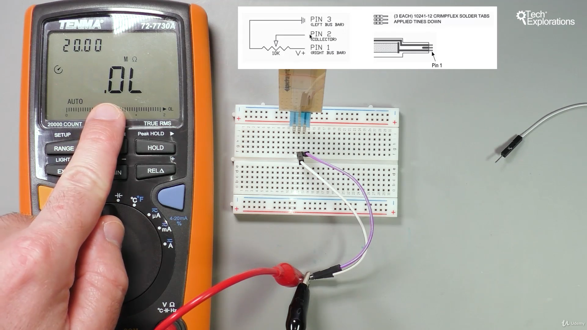

22. [0620a] [Introduction to the flex sensor](#22)
23. [0620b] [Flex sensor wiring](#23)
24. [0620c] [Flex sensor sketch](#24)
25. [0630a] [Introduction to the membrane potentiometer](#25)
26. [0630b] [Membrane potentiometer demonstration](#26)

---

### 22. [0620a] Introduction to the flex sensor<a id="22"></a>

- flex sensor datasheet [click me](https://www.sparkfun.com/datasheets/Sensors/Flex/FlexSensor.pdf)


#### 30 ohm resistance without bend


#### 80 ohm resistance with bend


#### Flex sensor is wired in voltage divider configuration


- The flex sensor resistance increase as we bend it

### 23. [0620b] Flex sensor wiring<a id="23"></a>


### 24. [0620c] Flex sensor sketch<a id="24"></a>

#### Output


```ino
/*  0620 - Flex sensor demo
 *
 * This sketch shows you how to use an analog flex sensor.
 * Connect the sensor to an analog pin. As the sensor is
 * flexed, the reading on the analog pin changes proportional.
 *
 * This sketch will turn on an LED when the sensor is flexed
 * past a threshold.
 *
 *
 * Components
 * ----------
 *  - Arduino Uno
 *  - a flex sensor
 *  - 5mm LED
 *  - 250 Ohm resistor for the LED
 *  - 20 kOhm resistor for the flex sensor
 *
 *  Libraries
 *  ---------
 *  None
 *
 * Connections
 * -----------
 *
 * Refer to the schematic that is available with this lecture.
 *
 *
 *
 *  Created on March 20 2017 by Peter Dalmaris
 *
 */

#define led_pin    8  //this is digital pin 8
#define flex_pin   0  //This is analog pin A0

 int flex_sensor_threshold = 700; // When the flex sensor reading is past this value
                                  // the LED will turn on.

void setup() {
  // put your setup code here, to run once:
  pinMode(led_pin , OUTPUT);
  pinMode(flex_pin, INPUT);  //Not necessary since analog pins are inputs by default

  Serial.begin(9600);  //We'll use the serial monitor to see the flex sensor values
}

void loop() {
  int flexposition;    // Input value from the analog pin.
  flexposition = analogRead(flex_pin);
  Serial.println(flexposition);

  if (flexposition > flex_sensor_threshold)
  {
    // turn LED on:
    digitalWrite(led_pin, HIGH);
  } else
  {
    // turn LED off:
    digitalWrite(led_pin, LOW);
  }
  delay(100);
}
```

notice-

- the voltage divider wire is attach to A0 pin, ADC generate sampled digital value 0-1023

### 25. [0630a] Introduction to the membrane potentiometer<a id="25"></a>


#### No pressure show open circuit, max resistance



#### Applying pressure decreases the resistance


- Membrane Potentiometer datasheet [click me](https://www.sparkfun.com/datasheets/Sensors/Flex/SoftPot-Datasheet.pdf)

notice-

- the voltage divider wire is attach to A0 pin, ADC generate sampled digital value 0-1023

### 26. [0630b] Membrane potentiometer demonstration<a id="26"></a>


#### apply pressure on middle


#### apply pressure on top


#### apply pressure on bottom


---

flipping voltage regulator wiring

#### apply pressure on top


#### apply pressure on middle


#### apply pressure on bottom


```ino
/*  0630 - Membrane potentiometer
 *
 * This sketch shows you how to use the membrane potentiometer.
 * This device works like a rotary potentiometer, but instead of
 * rotating a knob in order to change its resistance, your apply
 * pressure anywhere on its surface. The out resistance of the
 * device depends on the location of the pressure.
 *
 *
 * Components
 * ----------
 *  - Arduino Uno
 *  - a membrane potentiometer
 *
 *  Libraries
 *  ---------
 *  None
 *
 * Connections
 * -----------
 *
 * Refer to the schematic that is available with this lecture.
 * If the schematic is not available, follow these instructions:
 *
 * As you are looking at the front of the membrane potentiometer,
 * the pin on the left is 1, the middle is 2, and the right is 3.
 *
 *     Arduino |   Potentiometer
 *     --------|----------------
 *        GND  |        1
 *        A0   |        2
 *        5V   |        3
 *
 *
 *  Created on March 21 2017 by Peter Dalmaris
 *
 */


int potPin = A0;    // select the input pin for the potentiometer
int potValue = 0;  // variable to store the value coming from the sensor

void setup() {
  // declare the ledPin as an OUTPUT:
  pinMode(potPin, INPUT);
  Serial.begin(9600);
}

void loop() {
  // read the value from the sensor:
  potValue = analogRead(potPin);
  Serial.println(potValue);
  delay(100);
}
```
