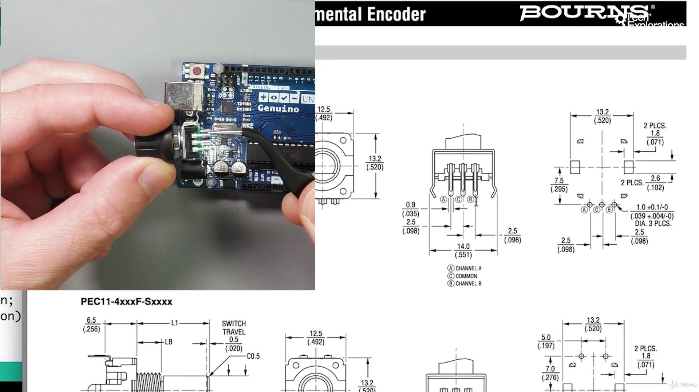

27. [0640a] [Introduction to the rotary encoder](#27)
28. [0640b] [Rotary encoder wiring and quadrature encoding](#28)
29. [0640c] [Rotary encoder sketch](#29)

---

### 27. [0640a] Introduction to the rotary encoder

#### Rotary encoder on oscilloscope

#### What is bouncing effect

#### Pins

- PEC11R Series - 12 mm Incremental Encoder datasheet [click me](https://www.bourns.com/docs/Product-Datasheets/PEC11R.pdf)

### 28. [0640b] Rotary encoder wiring and quadrature encoding

### 29. [0640c] Rotary encoder sketch
