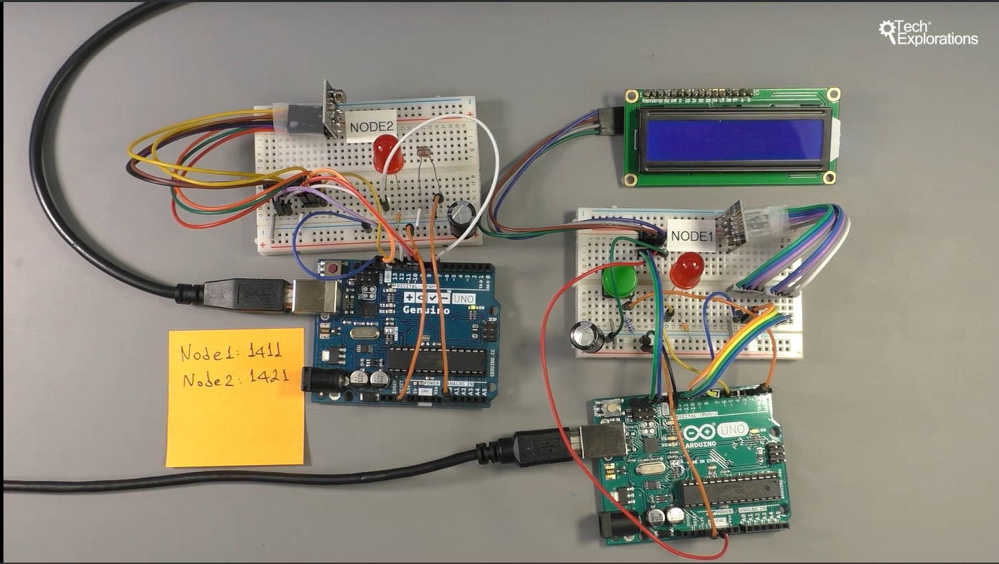

211. [1300a] [Introduction to the nRF24](#211)
212. [1300b] [Module pinout](#212)
213. [1300c] [Simple test wiring](#213)
214. [1300d] [Simple test sketch](#214)
215. [1300e] [Simple test demo](#215)
216. [1300f] [Comprehensive demo](#216)
217. [1300g] [Comprehensive demo sketch](#217)

---

### 211. [1300a] Introduction to the nRF24<a id="211"></a>

### 212. [1300b] Module pinout<a id="212"></a>


1. CE: control data transmission & reception
1. SCK: SPI clock
1. MISO: Send data out from module to arduino
1. IRQ: Interrupt to arduino when new data received by the module
1. MOSI: Input data goes into this pin from arduino
1. CSN: selecting & enabling device

### 213. [1300c] Simple test wiring<a id="213"></a>

- Open arduino, go to sketch--> include library--> manage libraries--> search: nrf24 by TMRh20--> install


### 214. [1300d] Simple test sketch<a id="214"></a>


#### Transmitter

```ino
/*  1300a2 - nRF24 Transmitter
 *
 * This sketch shows how to create a simple transmitter using the nRF24 module.
 *
 * This sketch was written by Peter Dalmaris for Arduino Step by Step
 *
 * Components
 * ----------
 *  - Arduino Uno
 *  - nRF24L01+
 *  - 470 uF capacitor
 *  - Jumper wires
 *
 *  Libraries
 *  ---------
 *  - SPI
 *  - RF24
 *
 * Connections
 * -----------
 * Arduino Uno and nRF24 (consult the schematic diagram as most
 * nRF24 modules don't include any pin markings):
 *
 *  Arduino Uno   |      nRF24
 *  ------------------------------
 *        -       |       IRQ
 *        11      |       MOSI
 *        10      |       CSN
 *        5V      |       VCC
 *        GND     |       GND
 *        9       |       CE
 *        13      |       SCK
 *        12      |       MISO
 *
 *
 *  Connect the capacitor between the GND and 3.3V pins (beware of the polarity).
 *
 *
 *  Created on October 19 2017 by Peter Dalmaris, Tech Explorations, txplore.com
 *
 */

#include <SPI.h>
#include "RF24.h"

#define BAUDRATE 9600

char message = 'A';

int led_pin = 8;

RF24 radio(9,10);

// Radio pipe addresses for the 2 nodes to communicate.
const uint64_t pipes[2] = { 0xF0F0F0F0E1LL, 0xF0F0F0F0D2LL };

void setup()
{
  Serial.begin(BAUDRATE);

  radio.begin();
  radio.openWritingPipe(pipes[0]);
  radio.openReadingPipe(1,pipes[1]);
  radio.printDetails();
}

void loop()
{
    radio.stopListening();
    Serial.print("Sending:");
    Serial.print(message);
    Serial.print(" ");
    radio.write( &message, 1 );
    // Now, continue listening
    radio.startListening();

    // Wait here until we get a response, or timeout (250ms)
    unsigned long started_waiting_at = millis();
    bool timeout = false;
    while ( ! radio.available() && ! timeout )
      if (millis() - started_waiting_at > 200 )
        timeout = true;

    // Describe the results
    if ( timeout )
    {
      Serial.println("Failed, response timed out.");

    }
    else
    {
      // Grab the response, compare, and send to debugging spew
      byte response;
      radio.read( &response, sizeof(response) );
      Serial.print("Transmitter. Received response from receiver:");
      Serial.println(response,BIN);

      if (response == B0)
      {
        digitalWrite(led_pin,HIGH);
        Serial.println("Ok");
      }
      else
      {
        digitalWrite(led_pin,LOW);
        Serial.println("No connection");
      }
    }

    // Try again  later
    delay(150);

}
```

#### Receiver

```ino
/*  1300a1 - nRF24 Receiver
 *
 * This sketch shows how to create a simple receiver using the nRF24 module.
 *
 * This sketch was written by Peter Dalmaris for Arduino Step by Step
 *
 * Components
 * ----------
 *  - Arduino Uno
 *  - nRF24L01+
 *  - 470 uF capacitor
 *  - Jumper wires
 *
 *  Libraries
 *  ---------
 *  - SPI
 *  - RF24
 *
 * Connections
 * -----------
 * Arduino Uno and nRF24 (consult the schematic diagram as most
 * nRF24 modules don't include any pin markings):
 *
 *  Arduino Uno   |      nRF24
 *  ------------------------------
 *        -       |       IRQ
 *        11      |       MOSI
 *        10      |       CSN
 *        5V      |       VCC
 *        GND     |       GND
 *        9       |       CE
 *        13      |       SCK
 *        12      |       MISO
 *
 *
 *  Connect the capacitor between the GND and 3.3V pins (beware of the polarity).
 *
 *
 *  Created on October 19 2017 by Peter Dalmaris, Tech Explorations, txplore.com
 *
 */

#include <SPI.h>
#include "RF24.h"

RF24 radio(9,10);

// Radio pipe addresses for the 2 nodes to communicate.
const uint64_t pipes[2] = { 0xF0F0F0F0E1LL, 0xF0F0F0F0D2LL };

void setup()
{
  Serial.begin(9600);

  radio.begin();
  radio.openWritingPipe(pipes[1]);
  radio.openReadingPipe(1,pipes[0]);
  radio.startListening();
  Serial.println("Listening");
}

void loop()
{
    // if there is data ready
    if ( radio.available() )
    {
      Serial.print("Receiver.");
      char transmission;
      bool done = false;
      // Fetch the payload, and see if this was the last one.
      radio.read( &transmission, 1 );

      // Spew it
      Serial.print("Received from transmitter:");
      Serial.println(transmission);

  // Delay just a little bit to let the other unit
  // make the transition to receiver
  delay(20);


      // First, stop listening so we can talk
      radio.stopListening();

      // Send the final one back.
      byte response = B0;
      radio.write( &response, sizeof(response) );
      Serial.println("Sent response.\n\r");

      // Now, resume listening so we catch the next packets.
      radio.startListening();

    }

}
```

### 215. [1300e] Simple test demo<a id="215"></a>


### 216. [1300f] Comprehensive demo<a id="216"></a>




#### Node 1

```ino
/*  1300b - nRF24 Node 1
 *
 *  This node has a, an LED, a button and an LCD. When the button is pressed, the LED goes on,
 *  and a message is send to Node 2. At Node 2, when the message is received an LED blinks for
 *  500msec, then a reading is taken from the photosensor, and the value is sent to Node 1.
 *  When Node 1 receives the value, it displays it on the LCD and turns off the LED.
 *
 *
 * This sketch was written by Peter Dalmaris for Arduino Step by Step
 *
 * Components
 * ----------
 *  - Arduino Uno
 *  - nRF24L01+
 *  - 470 uF capacitor
 *  - 1 x LED
 *  - 3 x 330 Ohm resistors
 *  - 1 x push button
 *  - 1 x 20 kOhm pull-down resistor
 *  - Jumper wires
 *
 *  Libraries
 *  ---------
 *  - SPI
 *  - RF24
 *  - LiquidCrystal_I2C
 *
 * Connections
 * -----------
 * Arduino Uno and nRF24 (consult the schematic diagram as most
 * nRF24 modules don't include any pin markings):
 *
 *  Arduino Uno   |      nRF24
 *  ------------------------------
 *        -       |       IRQ
 *        11      |       MOSI
 *        10      |       CSN
 *        5V      |       VCC
 *        GND     |       GND
 *        9       |       CE
 *        13      |       SCK
 *        12      |       MISO
 *
 *    I2C LCD     |    Arduino Uno
 *  -----------------------------
 *      GND       |      GND
 *      Vcc       |      5V
 *      SDA       |      SDA or A4
 *      SCL       |      SCL or A5
 *
 *  Connect the LED anode to digital pin 7 and the cathod via the 330 Ohm resistor
 *  to GND.
 *
 *  Connect the push button with the pull-down resistor to digital pin 2.
 *
 *  Connect the capacitor between the GND and 3.3V pins (beware of the polarity).
 *
 *
 *  Created on October 19 2017 by Peter Dalmaris, Tech Explorations, txplore.com
 *
 */


#include <SPI.h>
#include "RF24.h"
#include <LiquidCrystal_I2C.h>

LiquidCrystal_I2C lcd(0x27,16,2);

#define BAUDRATE 9600

// We'll just send the char 'A' to trigger a response from Node 2
char message = 'A';

// constants for the LED and button pins
const int buttonPin = 2;
const int ledPin = 7;

// Variables for the LED and the button
int ledState = LOW;         // the current state of the output pin
int buttonState;             // the current reading from the input pin
int lastButtonState = LOW;   // the previous reading from the input pin

// the following variables are long's because the time, measured in miliseconds,
// will quickly become a bigger number than can be stored in an int.
long lastDebounceTime = 0;  // the last time the output pin was toggled
long debounceDelay = 50;    // the debounce time; increase if the output flickers

RF24 radio(9, 10);

// Radio pipe addresses for the 2 nodes to communicate.
const uint64_t pipes[2] = { 0xF0F0F0F0E1LL, 0xF0F0F0F0D2LL };

void setup()
{
  Serial.begin(BAUDRATE);

  // Setup the pins
  pinMode(buttonPin, INPUT);
  pinMode(ledPin, OUTPUT);
  digitalWrite(ledPin, ledState);

  // Setup the LCD screen
  lcd.init();
  lcd.backlight();
  lcd.setCursor(0, 0);

  // Setup the nRF24
  radio.begin();
  radio.openWritingPipe(pipes[0]);
  radio.openReadingPipe(1, pipes[1]);
//  radio.printDetails();
  Serial.println("Node 1 ready");

}

void loop()
{
  //Get a reading from the button. Using software debounce to avoid rapid
  //ghost button presses
  int reading = digitalRead(buttonPin);

  // check to see if you just pressed the button
  // (i.e. the input went from LOW to HIGH),  and you've waited
  // long enough since the last press to ignore any noise:

  // If the switch changed, due to noise or pressing:
  if (reading != lastButtonState) {
    // reset the debouncing timer
    lastDebounceTime = millis();
  }

  if ((millis() - lastDebounceTime) > debounceDelay) {
    // whatever the reading is at, it's been there for longer
    // than the debounce delay, so take it as the actual current state:

    // if the button state has changed:
    if (reading != buttonState) {
      buttonState = reading;

      // only toggle the LED if the new button state is HIGH
      if (buttonState == HIGH) {
        //          ledState = !ledState;
        digitalWrite(ledPin, HIGH);
        radio.stopListening();
        Serial.print("Sending:");
        Serial.print(message);
        Serial.print(" ");
        radio.write( &message, sizeof(unsigned long) );
        // Now, continue listening
        radio.startListening();
      }
    }
  }

  // Save the reading.  Next time through the loop,
  // it'll be the lastButtonState:
  lastButtonState = reading;

  // Wait here until we get a response, or timeout (250ms)
  unsigned long started_waiting_at = millis();
  bool timeout = false;
  while ( ! radio.available() && ! timeout )
    if (millis() - started_waiting_at > 200 )
      timeout = true;

  // Describe the results
  if ( timeout )
  {
    Serial.println("Failed, response timed out.");
  }
  else
  {
    // Get the response and print it to the LCD
    int response;
    radio.read( &response, sizeof(response) );
    Serial.print("Transmitter. Received response from receiver:");
    Serial.println(response);
    lcd.clear();
    lcd.setCursor(0, 0);
    lcd.print(response);
    digitalWrite(ledPin, LOW);
  }

  // Try again  later
  delay(150);

}
```

#### Node 2

```ino
/*  1300c - nRF24 Node 2
 *
 * This node has an LED, and a photoresistor. When it receives a message (trigger) from
 * Node 1, it will turn on the LED for 500ms and respond with the value of the photo-resistor.
 *
 *
 * This sketch was written by Peter Dalmaris for Arduino Step by Step
 *
 * Components
 * ----------
 *  - Arduino Uno
 *  - nRF24L01+
 *  - 470 uF capacitor
 *  - 1 x LED
 *  - 1 x 330 Ohm resistors
 *  - 1 x photoresistor
 *  - 1 x 10 kOhm resistor
 *  - Jumper wires
 *
 *  Libraries
 *  ---------
 *  - SPI
 *  - RF24
 *  - LiquidCrystal_I2C
 *
 * Connections
 * -----------
 * Arduino Uno and nRF24 (consult the schematic diagram as most
 * nRF24 modules don't include any pin markings):
 *
 *  Arduino Uno   |      nRF24
 *  ------------------------------
 *        -       |       IRQ
 *        11      |       MOSI
 *        10      |       CSN
 *        5V      |       VCC
 *        GND     |       GND
 *        9       |       CE
 *        13      |       SCK
 *        12      |       MISO
 *
 *  Connect the LED anode to digital pin 7 and the cathod via the 330 Ohm resistor
 *  to GND.
 *
 *  Connect the photo resistor and 10 kOhm resistor to GND and 5V, and their junction
 *  to analog pin 0.
 *
 *  Connect the capacitor between the GND and 3.3V pins (beware of the polarity).
 *
 *
 *  Created on October 19 2017 by Peter Dalmaris, Tech Explorations, txplore.com
 *
 */

#include <SPI.h>
#include "RF24.h"

#define BAUDRATE 9600

const int ledPin = 7;

RF24 radio(9, 10);

// Radio pipe addresses for the 2 nodes to communicate.
const uint64_t pipes[2] = { 0xF0F0F0F0E1LL, 0xF0F0F0F0D2LL };

void setup()
{
  Serial.begin(BAUDRATE);

  pinMode(ledPin, OUTPUT);

  // set initial LED state
  digitalWrite(ledPin, LOW);

  radio.begin();
  radio.openWritingPipe(pipes[1]);
  radio.openReadingPipe(1, pipes[0]);
  radio.startListening();
  Serial.println("Node 2 ready");
}

void loop()
{

  // if there is data ready
  if ( radio.available() )
  {
    Serial.print("Receiver.");
    char transmission;
    radio.read( &transmission, 1 );
    // Print out the content of "transmission"
    Serial.print("Received from transmitter:");
    Serial.println(transmission);

    // Delay just a little bit to let the other unit
    // make the transition to receiver
    delay(20);

    // First, stop listening so we can talk
    radio.stopListening();

    // Send the final one back.
    int response = analogRead(0);
    radio.write( &response, sizeof(response) );
    Serial.println("Sent response.\n\r");

    digitalWrite(ledPin, HIGH);
    delay(500);
    digitalWrite(ledPin, LOW);

    // Now, resume listening so we catch the next packets.
    radio.startListening();

  }

}
```

### 217. [1300g] Comprehensive demo sketch<a id="217"></a>
