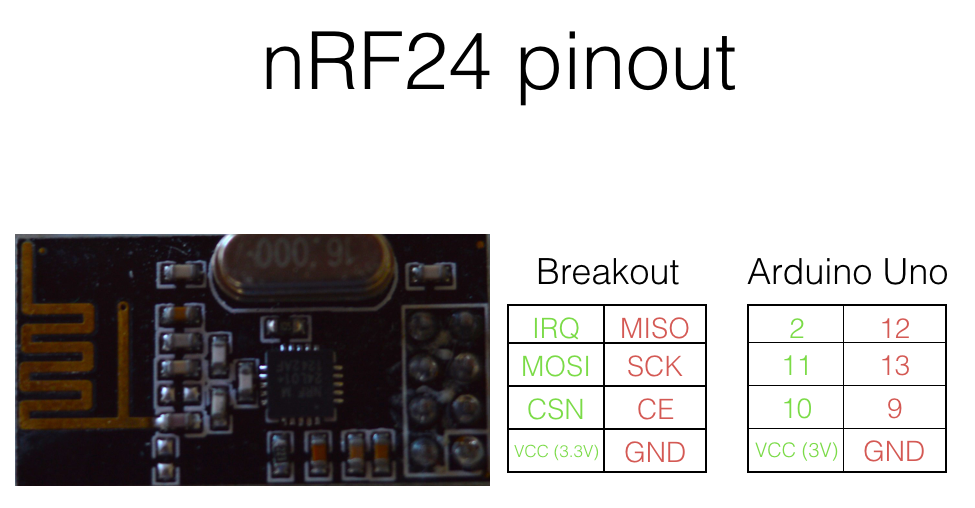
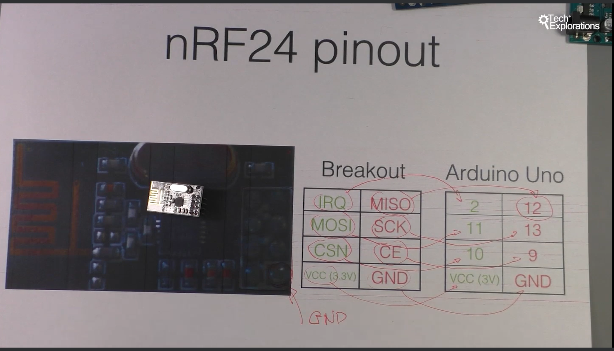
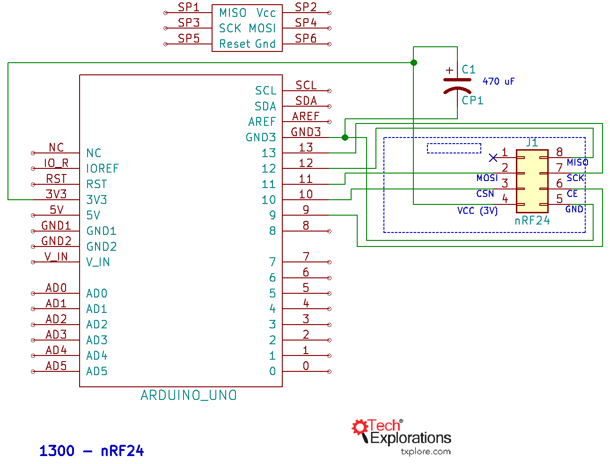
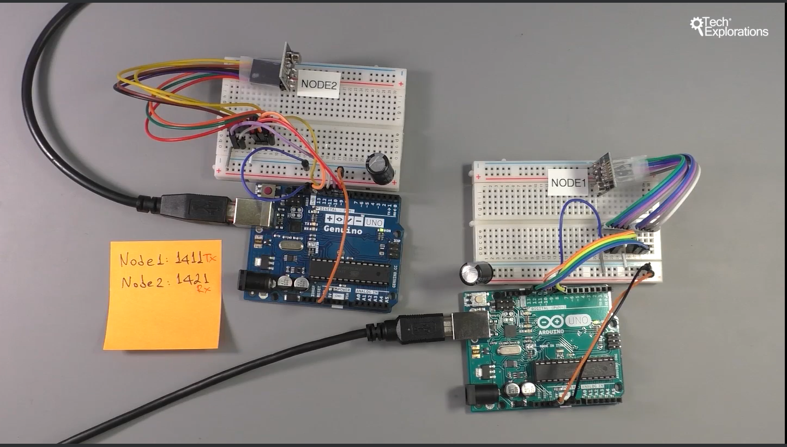
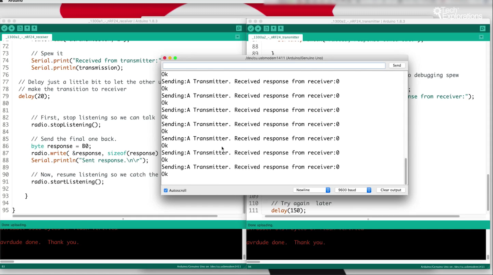
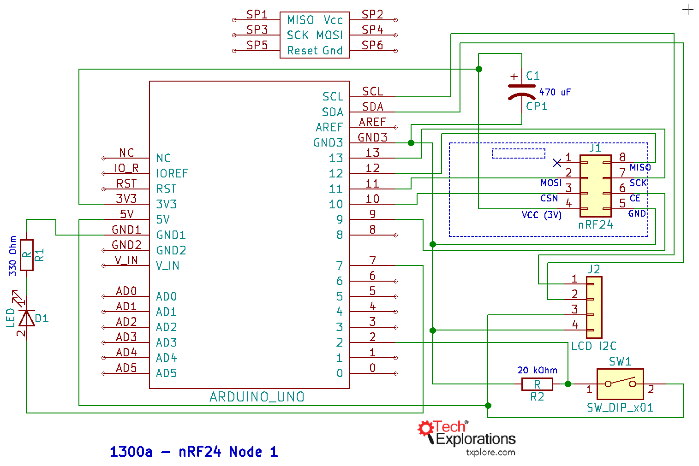
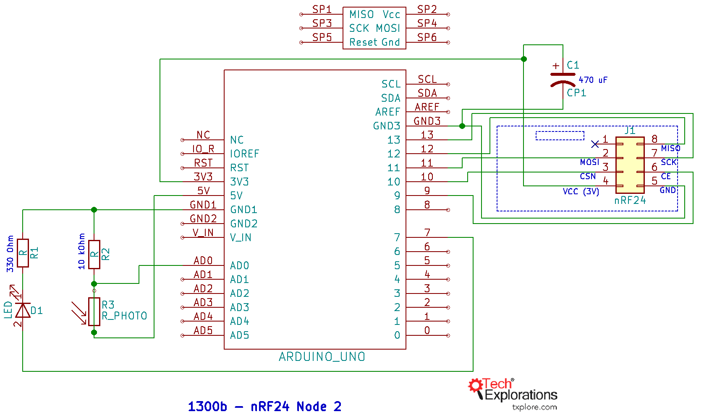

211. [1300a] [Introduction to the nRF24](#211)
212. [1300b] [Module pinout](#212)
213. [1300c] [Simple test wiring](#213)
214. [1300d] [Simple test sketch](#214)
215. [1300e] [Simple test demo](#215)
216. [1300f] [Comprehensive demo](#216)
217. [1300g] [Comprehensive demo sketch](#217)

---

### 211. [1300a] Introduction to the nRF24<a id="211"></a>

### 212. [1300b] Module pinout<a id="212"></a>





1. CE: control data transmission & reception
1. SCK: SPI clock
1. MISO: Send data out from module to arduino
1. IRQ: Interrupt to arduino when new data received by the module
1. MOSI: Input data goes into this pin from arduino
1. CSN: selecting & enabling device

### 213. [1300c] Simple test wiring<a id="213"></a>

- Open arduino, go to sketch--> include library--> manage libraries--> search: nrf24 by TMRh20--> install




### 214. [1300d] Simple test sketch<a id="214"></a>


#### Transmitter

```ino
/*  1300a2 - nRF24 Transmitter
 *
 * This sketch shows how to create a simple transmitter using the nRF24 module.
 *
 * This sketch was written by Peter Dalmaris for Arduino Step by Step
 *
 * Components
 * ----------
 *  - Arduino Uno
 *  - nRF24L01+
 *  - 470 uF capacitor
 *  - Jumper wires
 *
 *  Libraries
 *  ---------
 *  - SPI
 *  - RF24
 *
 * Connections
 * -----------
 * Arduino Uno and nRF24 (consult the schematic diagram as most
 * nRF24 modules don't include any pin markings):
 *
 *  Arduino Uno   |      nRF24
 *  ------------------------------
 *        -       |       IRQ
 *        11      |       MOSI
 *        10      |       CSN
 *        5V      |       VCC
 *        GND     |       GND
 *        9       |       CE
 *        13      |       SCK
 *        12      |       MISO
 *
 *
 *  Connect the capacitor between the GND and 3.3V pins (beware of the polarity).
 *
 *
 *  Created on October 19 2017 by Peter Dalmaris, Tech Explorations, txplore.com
 *
 */

#include <SPI.h>
#include "RF24.h"

#define BAUDRATE 9600

char message = 'A';

int led_pin = 8;

RF24 radio(9,10);

// Radio pipe addresses for the 2 nodes to communicate.
const uint64_t pipes[2] = { 0xF0F0F0F0E1LL, 0xF0F0F0F0D2LL };

void setup()
{
  Serial.begin(BAUDRATE);

  radio.begin();
  radio.openWritingPipe(pipes[0]);
  radio.openReadingPipe(1,pipes[1]);
  radio.printDetails();
}

void loop()
{
    radio.stopListening();
    Serial.print("Sending:");
    Serial.print(message);
    Serial.print(" ");
    radio.write( &message, 1 );
    // Now, continue listening
    radio.startListening();

    // Wait here until we get a response, or timeout (250ms)
    unsigned long started_waiting_at = millis();
    bool timeout = false;
    while ( ! radio.available() && ! timeout )
      if (millis() - started_waiting_at > 200 )
        timeout = true;

    // Describe the results
    if ( timeout )
    {
      Serial.println("Failed, response timed out.");

    }
    else
    {
      // Grab the response, compare, and send to debugging spew
      byte response;
      radio.read( &response, sizeof(response) );
      Serial.print("Transmitter. Received response from receiver:");
      Serial.println(response,BIN);

      if (response == B0)
      {
        digitalWrite(led_pin,HIGH);
        Serial.println("Ok");
      }
      else
      {
        digitalWrite(led_pin,LOW);
        Serial.println("No connection");
      }
    }

    // Try again  later
    delay(150);

}
```

#### Receiver

```ino
/*  1300a1 - nRF24 Receiver
 *
 * This sketch shows how to create a simple receiver using the nRF24 module.
 *
 * This sketch was written by Peter Dalmaris for Arduino Step by Step
 *
 * Components
 * ----------
 *  - Arduino Uno
 *  - nRF24L01+
 *  - 470 uF capacitor
 *  - Jumper wires
 *
 *  Libraries
 *  ---------
 *  - SPI
 *  - RF24
 *
 * Connections
 * -----------
 * Arduino Uno and nRF24 (consult the schematic diagram as most
 * nRF24 modules don't include any pin markings):
 *
 *  Arduino Uno   |      nRF24
 *  ------------------------------
 *        -       |       IRQ
 *        11      |       MOSI
 *        10      |       CSN
 *        5V      |       VCC
 *        GND     |       GND
 *        9       |       CE
 *        13      |       SCK
 *        12      |       MISO
 *
 *
 *  Connect the capacitor between the GND and 3.3V pins (beware of the polarity).
 *
 *
 *  Created on October 19 2017 by Peter Dalmaris, Tech Explorations, txplore.com
 *
 */

#include <SPI.h>
#include "RF24.h"

RF24 radio(9,10);

// Radio pipe addresses for the 2 nodes to communicate.
const uint64_t pipes[2] = { 0xF0F0F0F0E1LL, 0xF0F0F0F0D2LL };

void setup()
{
  Serial.begin(9600);

  radio.begin();
  radio.openWritingPipe(pipes[1]);
  radio.openReadingPipe(1,pipes[0]);
  radio.startListening();
  Serial.println("Listening");
}

void loop()
{
    // if there is data ready
    if ( radio.available() )
    {
      Serial.print("Receiver.");
      char transmission;
      bool done = false;
      // Fetch the payload, and see if this was the last one.
      radio.read( &transmission, 1 );

      // Spew it
      Serial.print("Received from transmitter:");
      Serial.println(transmission);

  // Delay just a little bit to let the other unit
  // make the transition to receiver
  delay(20);


      // First, stop listening so we can talk
      radio.stopListening();

      // Send the final one back.
      byte response = B0;
      radio.write( &response, sizeof(response) );
      Serial.println("Sent response.\n\r");

      // Now, resume listening so we catch the next packets.
      radio.startListening();

    }

}
```

### 215. [1300e] Simple test demo<a id="215"></a>





### 216. [1300f] Comprehensive demo<a id="216"></a>





### 217. [1300g] Comprehensive demo sketch<a id="217"></a>
