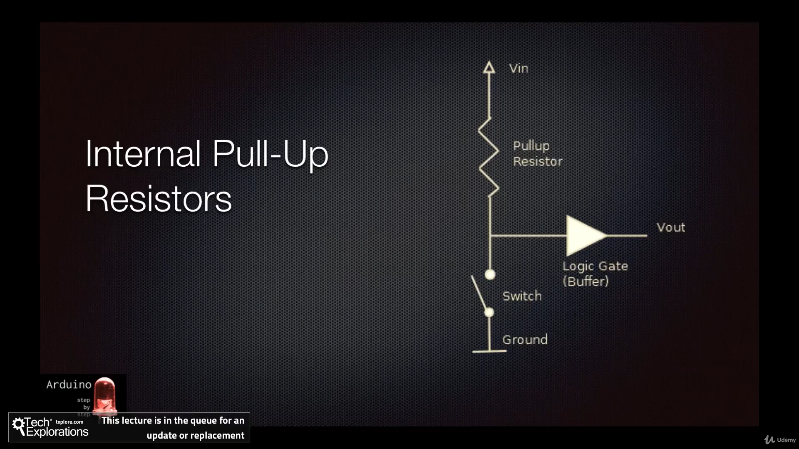
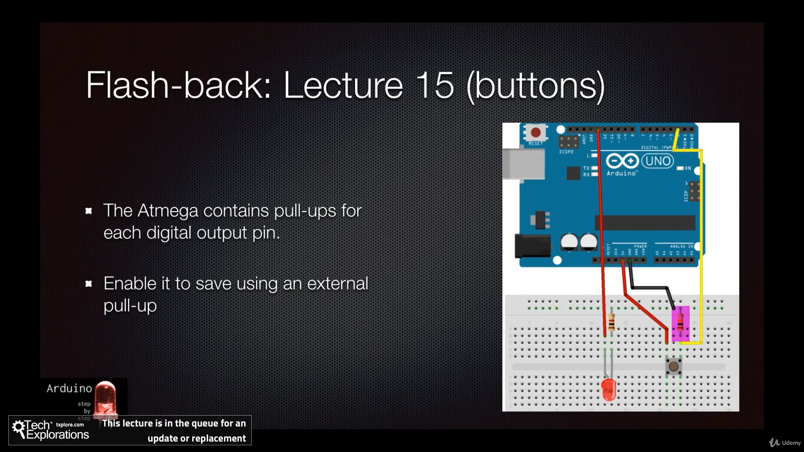
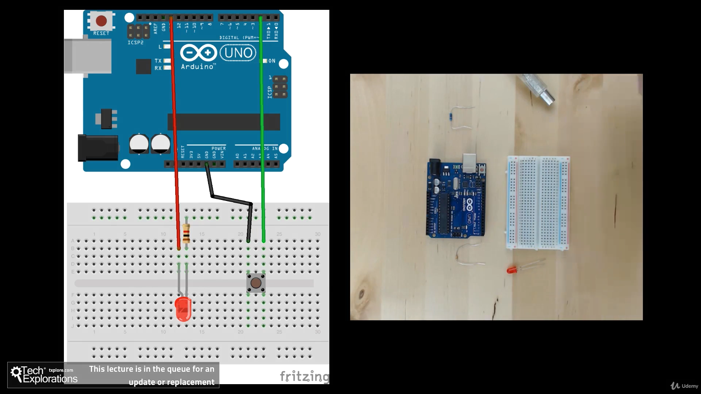
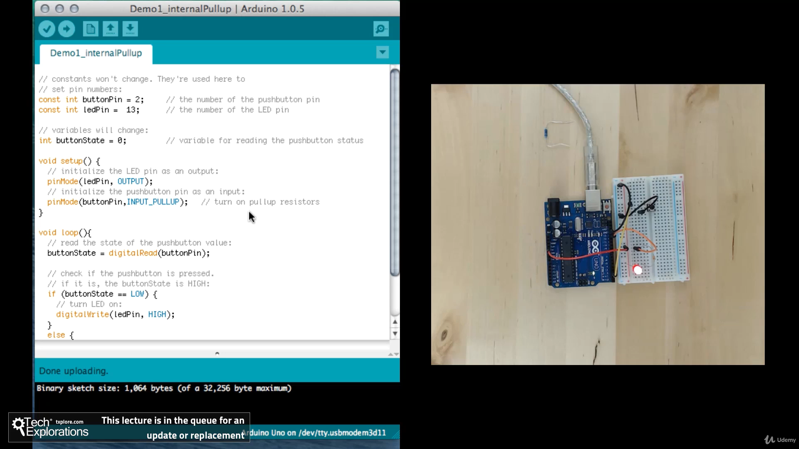
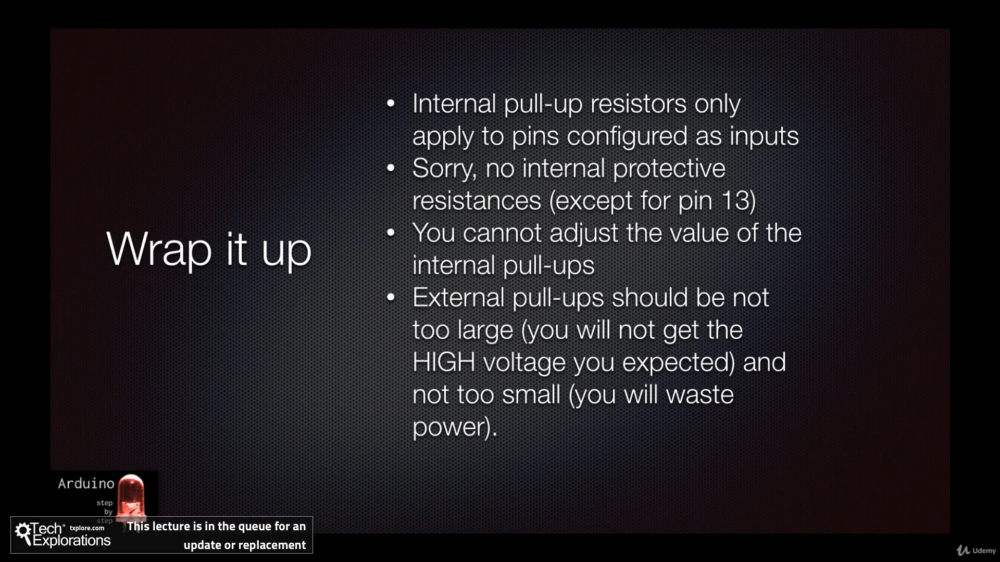

236. [2110] Using the build-in pull-up resistors

---

236. [2110] Using the build-in pull-up resistors











```ino

// constants won't change. They're used here to
// set pin numbers:
const int buttonPin = 2;     // the number of the pushbutton pin
const int ledPin =  13;      // the number of the LED pin

// variables will change:
int buttonState = 0;         // variable for reading the pushbutton status

void setup() {
  // initialize the LED pin as an output:
  pinMode(ledPin, OUTPUT);
  // initialize the pushbutton pin as an input:
  pinMode(buttonPin,INPUT_PULLUP);   // turn on pullup resistors
}

void loop(){
  // read the state of the pushbutton value:
  buttonState = digitalRead(buttonPin);

  // check if the pushbutton is pressed.
  // if it is, the buttonState is HIGH:
  if (buttonState == LOW) {
    // turn LED on:
    digitalWrite(ledPin, HIGH);
  }
  else {
    // turn LED off:
    digitalWrite(ledPin, LOW);
  }
}
```
