237. [1810a] [Hardware switch/button debouncing Part 1: Background](#237)
238. [1810b] [Hardware switch/button debouncing Part 2: Demo](#238)

---

### 237. [1810a] Hardware switch/button debouncing Part 1: Background<a id="237"></a>

- In case when we need to use push button, relay, switch, or anything mechanical use to close circuit, bouncing happen to clear up that noise the process is debouncing

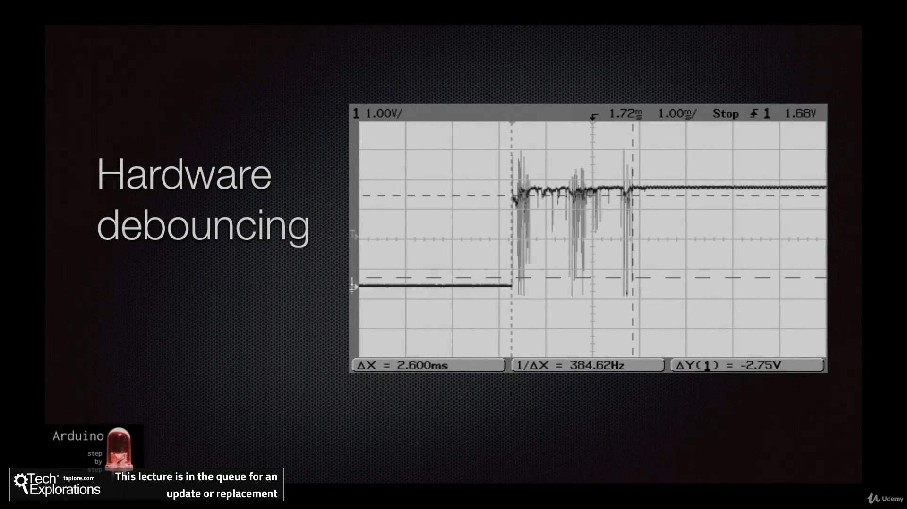


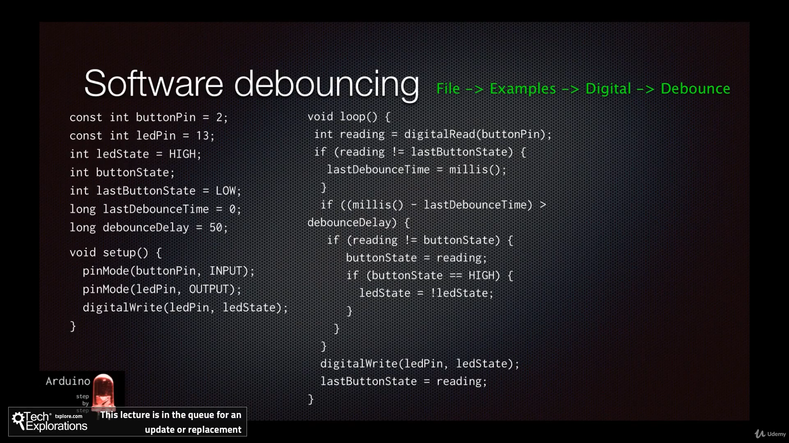

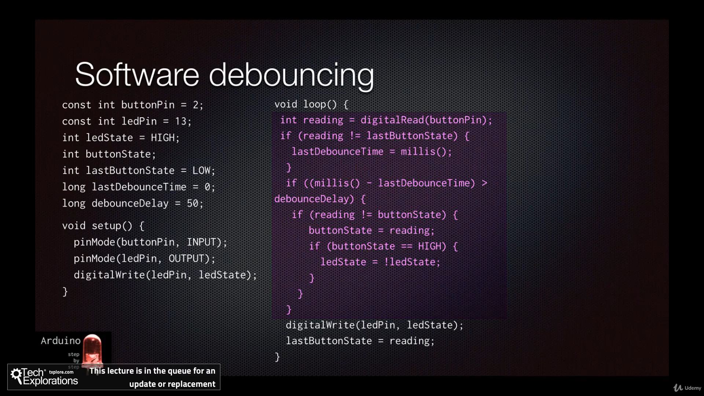

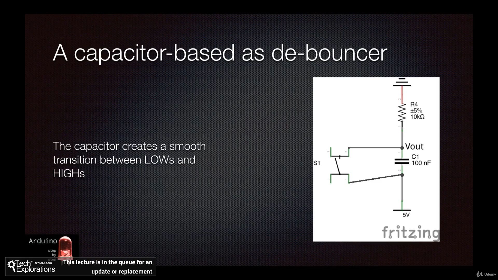

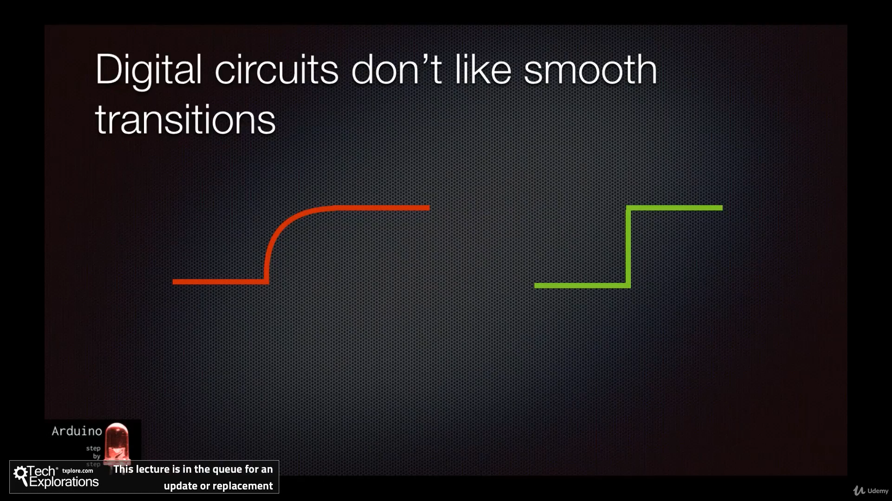

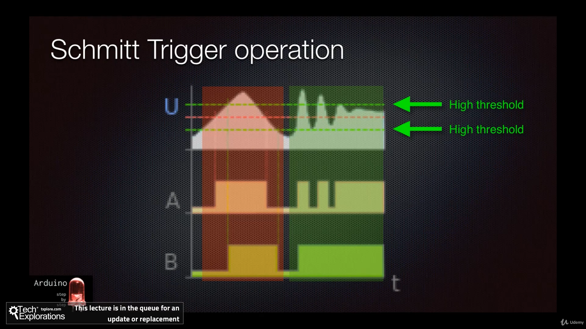

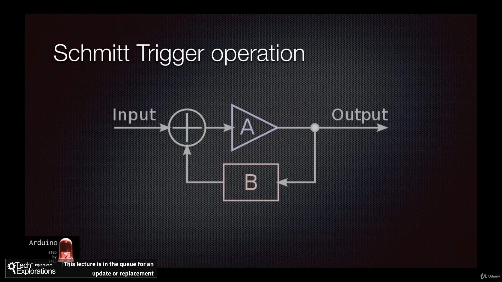

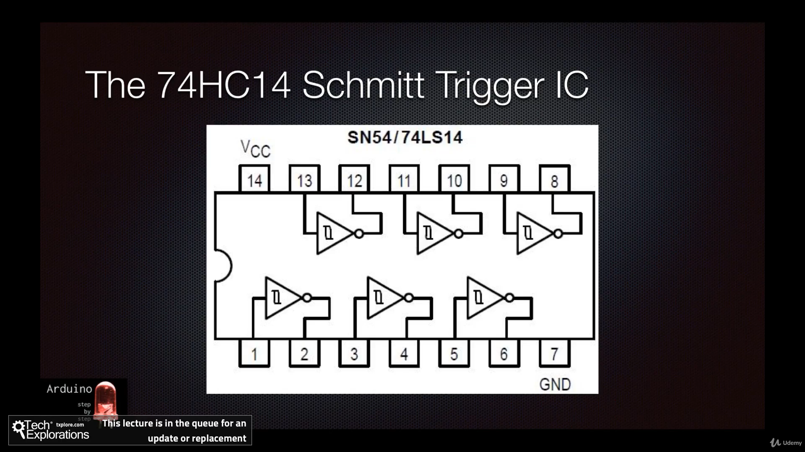

### 238. [1810b] Hardware switch/button debouncing Part 2: Demo<a id="238"></a>

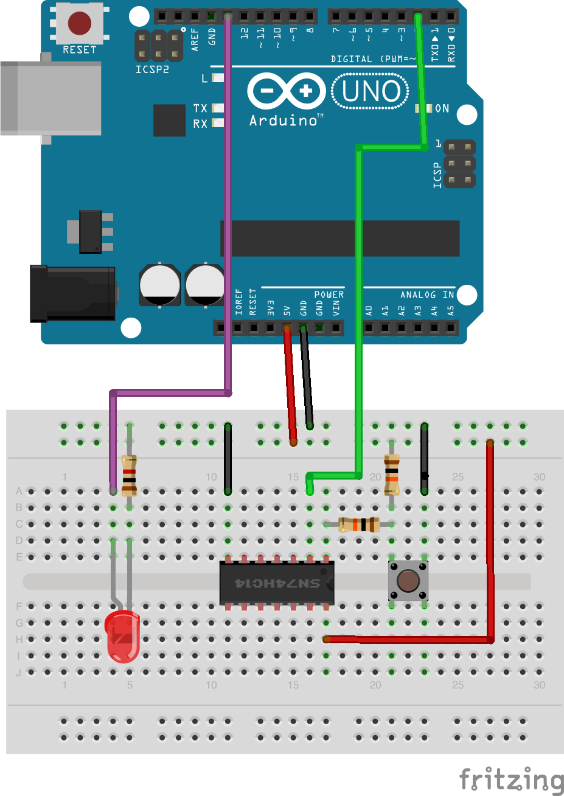

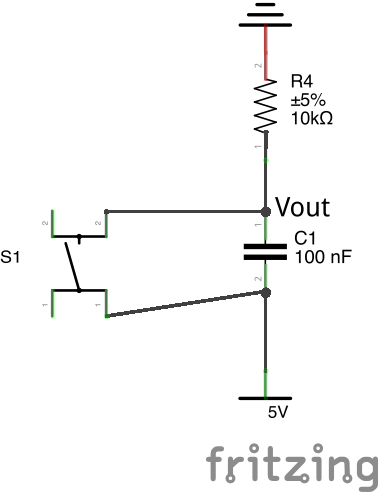

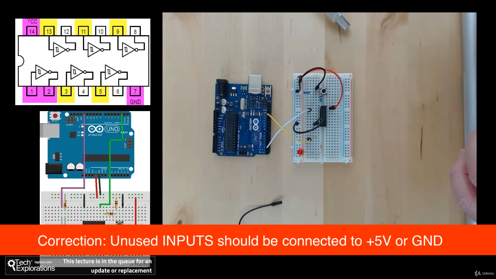

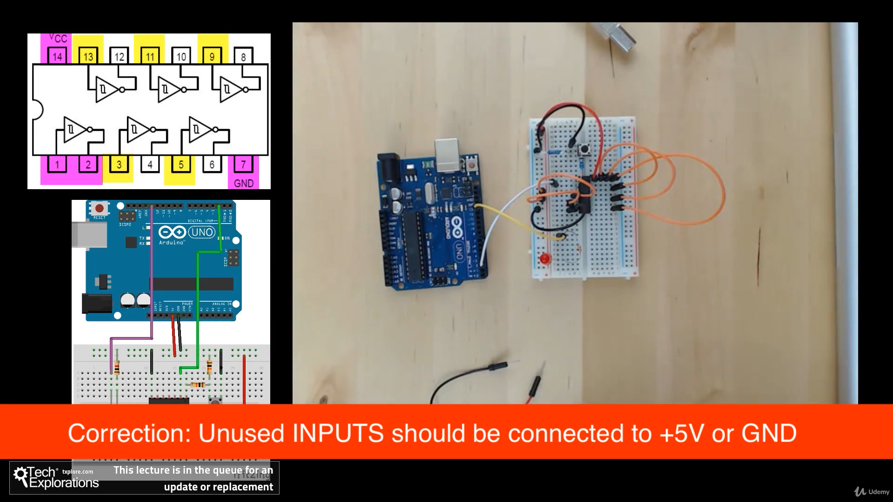

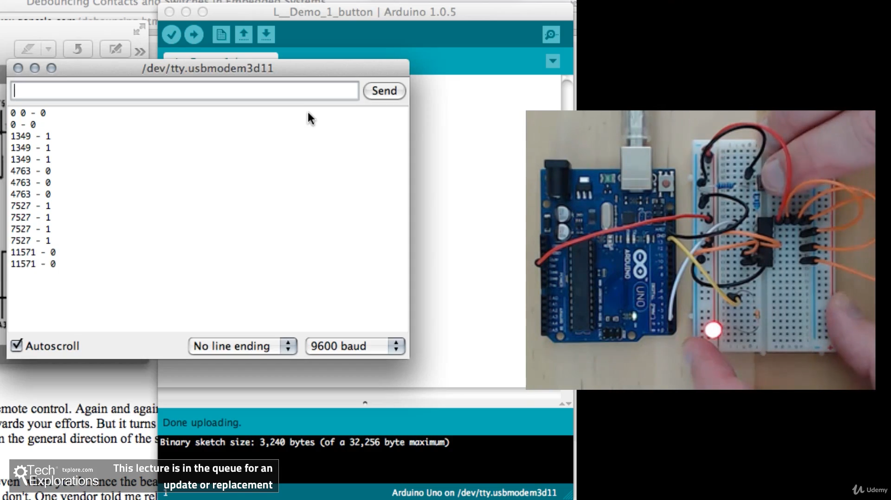

```ino
/*
Pushbutton interrupt sketch
a switch connected to interrupt pin 2 lights the LED on pin 13
*/
const int ledPin = 13;
const int inputPin = 2;
volatile boolean ledState = LOW;
volatile unsigned long time = millis();
void setup() {
  pinMode(ledPin, OUTPUT);
  attachInterrupt(0,buttonPressed,FALLING);
  Serial.begin(9600);
}

void loop()
  { Serial.print(time);
    Serial.print(" - ");
    Serial.println(ledState);
    delay(1000);
    }

void buttonPressed()
{
  time = millis();
  if (ledState==LOW)
  {
    ledState=HIGH;
      digitalWrite(ledPin,HIGH);
  } else
  {
     ledState=LOW;
      digitalWrite(ledPin,LOW);
  }
}


```
